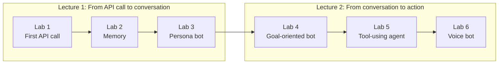
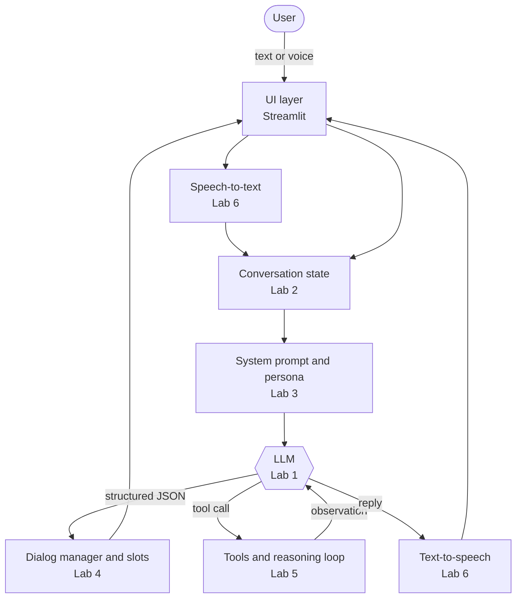

# 5350 Chatbot Labs: LLM-Driven Chatbots

Two lectures and six hands-on labs that take you from **your first LLM API call** to a **tool-using, voice-enabled agent**. The course uses Python, the OpenAI API and Streamlit.

> Course: STAT 5350/4350 · Audience: students who know basic Python. No prior AI experience needed.

## What's in this repo

| Folder | What it is | Who it's for |
|---|---|---|
| [`lectures/`](lectures/) | Two lectures with diagrams, demos and discussion questions | Everyone |
| [`labs/`](labs/) | Six self-contained labs, each with a README and code | Students |
| [`guides/STUDENT_GUIDE.md`](guides/STUDENT_GUIDE.md) | Setup, workflow, submission, troubleshooting | Students |
| [`guides/INSTRUCTOR_GUIDE.md`](guides/INSTRUCTOR_GUIDE.md) | Schedule, teaching notes, answer keys, rubric | Instructors |
| [`solutions/`](solutions/) | Reference solutions for the coding tasks | Instructors |
| [`resources/`](resources/) | Chatbot planning guide, LLM parameters handout, watsonx slides, spec-driven dev case study | Everyone |

## Course map

| | Lecture | Labs | Big idea |
|---|---|---|---|
| 1 | [From API call to conversation](lectures/lecture-01-llm-chatbot-foundations.md) | [Lab 1: First API call](labs/lab-01-first-api-call/) · [Lab 2: Memory](labs/lab-02-memory/) · [Lab 3: Persona bot](labs/lab-03-persona-bot/) | An LLM is a stateless next-token predictor. *You* build the conversation around it. |
| 2 | [From conversation to action](lectures/lecture-02-goal-oriented-bots-and-agents.md) | [Lab 4: PizzaBot](labs/lab-04-pizza-bot/) · [Lab 5: Reasoning agent](labs/lab-05-reasoning-agent/) · [Lab 6: Voice bot](labs/lab-06-voice-bot/) | Let the LLM *understand*; let your code *decide and act*. |

## Quick start

Works on **Windows, macOS and Linux**, with or without Docker. New to the command line? The [Student Guide](guides/STUDENT_GUIDE.md#1-one-time-setup) walks you through it step by step.

**1. Get the code:** `git clone https://github.com/iportilla/5350-chatbot.git`, or click **Code → Download ZIP** above and unzip it.

**2. Set up once** (it asks for your OpenAI API key):

| 🪟 Windows (PowerShell) | 🍎 macOS / 🐧 Linux | 🐳 Docker (any OS) |
|---|---|---|
| `scripts\setup.cmd` | `bash scripts/setup.sh` | copy `.env.sample` to `.env`, add your key, then `make docker-build` |

**3. Run a lab:**

| 🪟 Windows | 🍎 macOS / 🐧 Linux | 🐳 Docker |
|---|---|---|
| `scripts\run.cmd lab1` | `make lab1` | `make docker-lab1` |

Run `scripts\run.cmd` or `make help` to list every lab. Web labs open at <http://localhost:8501>.

What's under the hood?

| File | Role |
|---|---|
| [`run.py`](run.py) | Cross-platform launcher: `python run.py lab2` starts the right file in the right folder; `python run.py check` diagnoses setup problems |
| [`scripts/setup.sh`](scripts/setup.sh) · [`scripts/setup.ps1`](scripts/setup.ps1) (+ `setup.cmd`) | Create `.venv`, install packages, write `.env`, run the check |
| [`scripts/run.sh`](scripts/run.sh) · [`scripts/run.ps1`](scripts/run.ps1) (+ `run.cmd`) | Run `run.py` with the `.venv` Python, so there's nothing to activate |
| [`Makefile`](Makefile) | `make setup`, `make lab2`, `make test`, `make docker-lab2`, … |
| [`Dockerfile`](Dockerfile) · [`docker-compose.yml`](docker-compose.yml) | Container with all dependencies; the repo is mounted live and port 8501 is published |

> 🔐 **Never commit your `.env` file.** It's already in `.gitignore`. If you leak a key, revoke it right away in the OpenAI dashboard.

## The architecture you'll build, piece by piece

## Credits

Built from the earlier `openai-bot` exercises (Labs 1–5, voice apps, watsonx demo, Kiro spec-driven-development case study), reorganized into a two-lecture course.

License: see [LICENSE](LICENSE).
