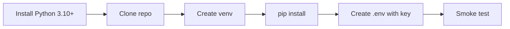
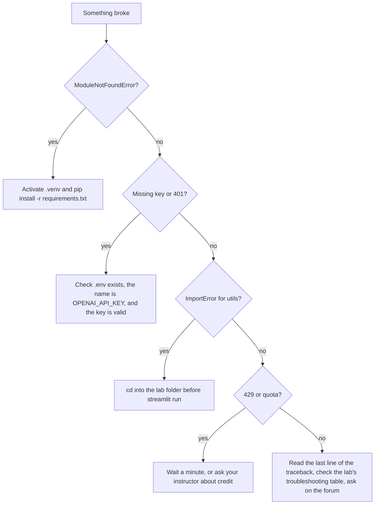

# Student Guide

Welcome! This guide covers everything you need outside the lab instructions themselves: setup, how to work through a lab, how to submit, and what to do when something breaks.

## Contents
1. [One-time setup](#1-one-time-setup)
2. [How each lab works](#2-how-each-lab-works)
3. [Running the code](#3-running-the-code)
4. [Submitting your work](#4-submitting-your-work)
5. [Using API keys responsibly](#5-using-api-keys-responsibly)
6. [Using AI assistants in this module](#6-using-ai-assistants-in-this-module)
7. [Troubleshooting](#7-troubleshooting)
8. [Glossary](#8-glossary)

---

## 1. One-time setup



**1. Check Python** (3.10 or newer):
```bash
python3 --version
```

**2. Clone the repository:**
```bash
git clone https://github.com/iportilla/5350-chatbot.git
cd 5350-chatbot
```

**3. Create and activate a virtual environment.** You must activate it in every new terminal:
```bash
python3 -m venv .venv
source .venv/bin/activate        # Windows PowerShell: .venv\Scripts\Activate.ps1
```
Your prompt should now start with `(.venv)`.

**4. Install the dependencies:**
```bash
pip install -r requirements.txt
```

**5. Add your API key.** Your instructor will tell you whether you'll use a class key or your own from <https://platform.openai.com/api-keys>.
```bash
cp .env.sample .env
```
Open `.env` and paste your key: `OPENAI_API_KEY="sk-..."`. One `.env` in the repo root works for every lab.

**6. Smoke test:**
```bash
python labs/lab-01-first-api-call/cli_chat.py
```
Type `hello`, then `quit`. If you got a reply, you're ready. 🎉

---

## 2. How each lab works

Every lab README follows the same structure:

| Section | What to do with it |
|---|---|
| **Goal / Learning objectives** | Read these first. They're what the reflection questions test |
| **How it works** (diagram) | Trace it with your finger before opening the code |
| **Steps** with ✅ **Checkpoints** | Don't move on until each checkpoint is true. Write down answers as you go |
| **Deliverables** | Exactly what to submit |
| **Stretch goals** | Optional; good for extra credit or your project |
| **Troubleshooting** | Check here first when something breaks |

**Suggested workflow**
1. Read the lab README from start to finish (5 min).
2. Run the code *before* changing anything.
3. Make one change at a time and re-run after each.
4. Keep a `notes.md` in the lab folder with checkpoint answers and screenshots. That's most of your submission.

---

## 3. Running the code

| Type | Command | Stop with |
|---|---|---|
| Terminal script | `python file.py` | `quit` or Ctrl+C |
| Streamlit app | `streamlit run file.py`, which opens <http://localhost:8501> | Ctrl+C in the terminal |
| Notebook | Open in VS Code or Jupyter and select the `.venv` kernel | |
| Tests (Lab 5) | `pytest -q` from the lab folder | |

> 💡 For Labs 2–6, `cd` into the lab folder first. The apps import their neighbour `utils.py`.
> 💡 Streamlit reloads when you save a file. Click **Rerun** in the top-right if it asks.

---

## 4. Submitting your work

For each lab, submit (to the LMS, or as a GitHub fork, whichever your instructor specifies):

- [ ] The code files you changed
- [ ] `notes.md` with your checkpoint answers and the reflection
- [ ] The screenshots or tables listed under **Deliverables**
- [ ] **No `.env` file and no API keys** anywhere in your submission

**Reflections are graded on reasoning, not length.** "The bot forgot my name because `web_chat.py` only sends `messages=[system, latest_user]`" beats a paragraph of generalities.

---

## 5. Using API keys responsibly

- 🔐 **Never** paste a key into code, a notebook cell, a screenshot, Slack or a commit. Keep it in `.env` only.
- If a key leaks, **revoke it immediately** at <https://platform.openai.com/api-keys> and tell your instructor.
- 💸 **Cost:** these labs use `gpt-4o-mini`, which is very cheap per turn. The things that burn credit are runaway loops (Lab 5 without `max_iterations`), very long chats (Lab 2 without trimming), and lots of TTS audio (Lab 6).
- Don't send personal or sensitive data to the API. Everything you type goes to a third-party service.

---

## 6. Using AI assistants in this module

You may use AI coding assistants for **explanations and debugging** unless your instructor says otherwise. But:

- The ✅ checkpoints and reflections ask *why*. Answer them in your own words, from what you observed.
- If an assistant writes code for you, say so in `notes.md` and explain each line you submit. You may be asked to walk through it live.
- The learning is in hitting the errors (Lab 5 Step 3 is *designed* to fail). Don't skip them.

---

## 7. Troubleshooting



| Error | Likely cause | Fix |
|---|---|---|
| `ModuleNotFoundError: openai` / `streamlit` | venv not active | `source .venv/bin/activate` |
| `Missing OPENAI_API_KEY` / `OPENAI_API_KEY not found` | No `.env`, or the wrong variable name | Must be exactly `OPENAI_API_KEY` |
| `openai.AuthenticationError` (401) | Bad or revoked key | Make a new key |
| `openai.RateLimitError` (429) | Too many requests, or no credit | Wait, or check billing |
| `NotFoundError: model ...` | The model has been retired | Change `MODEL` / `model=` to a current model |
| `AttributeError: module 'streamlit' has no attribute 'experimental_rerun'` | Old code | Use `st.rerun()` |
| `streamlit: command not found` | venv not active | Activate it, or use `python -m streamlit run ...` |
| Port 8501 in use | Another Streamlit app is running | Stop it, or `streamlit run app.py --server.port 8502` |

When you ask for help, include: **the lab and step, the command you ran, and the full error message** (never your key).

---

## 8. Glossary

| Term | Meaning |
|---|---|
| **LLM** | Large language model. Predicts the next token given previous tokens |
| **Token** | A chunk of text (about ¾ of a word). The unit of cost and limits |
| **Context window** | The maximum number of tokens the model can see at once |
| **Prompt / completion** | What you send / what the model generates |
| **System prompt** | Developer instructions that set the persona and rules |
| **Temperature** | Randomness of sampling. 0 is nearly deterministic, above 1 is very random |
| **Stateless** | The API remembers nothing between calls. You re-send the history |
| **Session state** | Streamlit's per-user storage that survives reruns |
| **Slot** | A piece of information a task bot must collect (size, crust…) |
| **FSM** | Finite-state machine. A fixed set of states and transitions |
| **Structured output / JSON mode** | Making the model reply in machine-readable JSON |
| **Tool / function calling** | The model asks your code to run a described function |
| **ReAct** | Reason + Act: a loop of think → call tool → observe → repeat |
| **Hallucination** | Fluent but false or unsupported output |
| **Prompt injection** | Input that tries to override your instructions |
| **STT / TTS** | Speech-to-text / text-to-speech |
