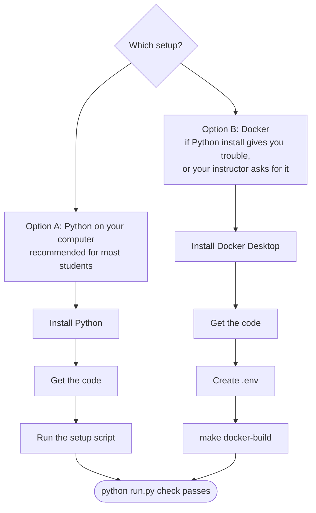
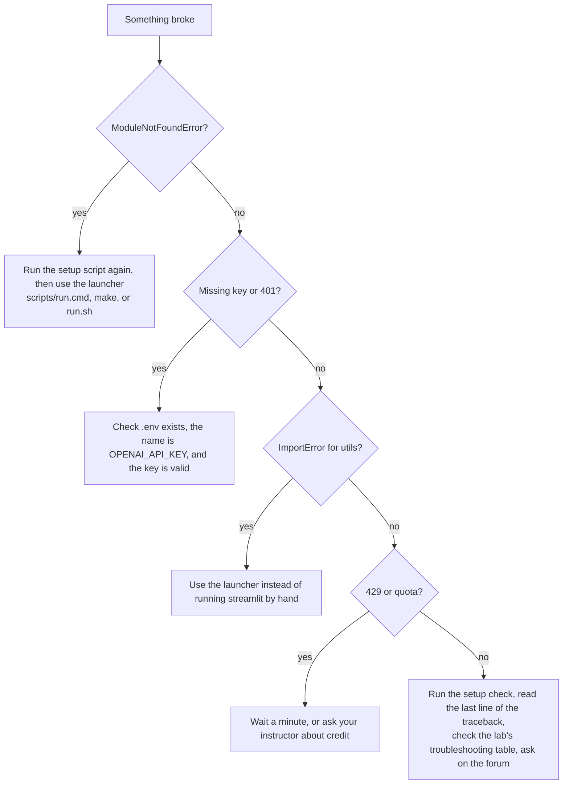

# Student Guide

Welcome! This guide covers everything you need outside the lab instructions themselves: setup, how to work through a lab, how to submit, and what to do when something breaks.

## Contents
1. [One-time setup](#1-one-time-setup)
2. [How each lab works](#2-how-each-lab-works)
3. [Running the code](#3-running-the-code)
4. [Submitting your work](#4-submitting-your-work)
5. [Using API keys responsibly](#5-using-api-keys-responsibly)
6. [Using AI assistants in this module](#6-using-ai-assistants-in-this-module)
7. [Troubleshooting](#7-troubleshooting)
8. [Glossary](#8-glossary)

---

## 1. One-time setup

There are **two ways** to set up. Pick one:



Both options give you the same labs. You only do this once.

> 🪟 **On Windows?** The [Windows Setup Guide](WINDOWS_README.md) covers all of this in more detail, including PowerShell basics, OneDrive and Notepad pitfalls, and Windows-only troubleshooting.

### 1.0 New to the command line? Read this first (5 min)

The **terminal** (also called the command line, shell or console) is a window where you type commands instead of clicking. You'll only need a handful of them.

**Open a terminal**

| Windows | macOS | Linux |
|---|---|---|
| Press **Start**, type **PowerShell** and open **Windows PowerShell** (or **Terminal** on Windows 11) | Press **⌘ Space**, type **Terminal**, press Enter | Press **Ctrl+Alt+T** |

**The only commands you need**

| What | Windows (PowerShell) | macOS / Linux |
|---|---|---|
| Where am I? | `pwd` | `pwd` |
| List files here | `dir` | `ls` |
| Go into a folder | `cd 5350-chatbot` | `cd 5350-chatbot` |
| Go up one folder | `cd ..` | `cd ..` |
| Go to your Downloads | `cd $HOME\Downloads` | `cd ~/Downloads` |
| Stop a running program | **Ctrl+C** | **Ctrl+C** |
| Repeat the last command | **↑** arrow key | **↑** arrow key |

**Tips**
- Type a few letters of a folder name and press **Tab**: the terminal completes it for you.
- When this guide shows a command in a grey box, copy it exactly. **Don't type the `$` or `>`** that some websites show at the start of commands.
- In this course, run commands **from inside the `5350-chatbot` folder**. If something says "file not found", run `pwd` and check you're in the right place.
- Paste in a terminal: **Ctrl+V** on Windows Terminal (or right-click in older PowerShell), **⌘V** on macOS, **Ctrl+Shift+V** on Linux.

> 💡 **Easier option:** open the `5350-chatbot` folder in **VS Code** (*File → Open Folder*), then use *Terminal → New Terminal*. It opens a terminal already in the right folder.

### 1.1 Get the code

**Option 1: with git** (if you have it: run `git --version` to check)
```bash
git clone https://github.com/iportilla/5350-chatbot.git
cd 5350-chatbot
```

**Option 2: no git.** Download the ZIP:
1. Go to <https://github.com/iportilla/5350-chatbot>, click the green **Code** button, then **Download ZIP**.
2. Unzip it. On Windows: right-click → **Extract All**.
3. Rename the folder from `5350-chatbot-main` to `5350-chatbot` (optional), then `cd` into it in your terminal.

### 1.2 Get an API key

Your instructor will tell you whether to use a **class key** or create your own at <https://platform.openai.com/api-keys>. Keep it somewhere private for the next step. **It's a password: never share it or commit it.**

### Option A: Python on your computer

<details open>
<summary><b>🪟 Windows</b></summary>

*Step-by-step walkthrough for beginners: [Windows Setup Guide](WINDOWS_README.md).*

1. **Install Python 3.10+** from <https://www.python.org/downloads/windows/>.
   ⚠️ On the first installer screen, **tick "Add python.exe to PATH"**, then click *Install Now*.
2. **Close and reopen** PowerShell (so it sees the new Python).
3. Go to the course folder and run the setup script:
   ```powershell
   cd $HOME\Downloads\5350-chatbot
   scripts\setup.cmd
   ```
   *(Or double-click `setup.cmd` inside the `scripts` folder in File Explorer.)*
4. When asked, **paste your API key** and press Enter. Nothing appears while you paste; that's normal.
5. At the end you should see `All good!`.

Run a lab:
```powershell
scripts\run.cmd lab1
```
</details>

<details>
<summary><b>🍎 macOS</b></summary>

1. **Install Python 3.10+** from <https://www.python.org/downloads/macos/> (or `brew install python` if you use Homebrew).
2. Go to the course folder and run the setup script:
   ```bash
   cd ~/Downloads/5350-chatbot
   bash scripts/setup.sh
   ```
3. When asked, **paste your API key** (⌘V) and press Enter. Nothing appears while you paste; that's normal.
4. At the end you should see `All good!`.

Run a lab:
```bash
make lab1
```
*(If `make` isn't found, use `bash scripts/run.sh lab1`, or install it with `xcode-select --install`.)*
</details>

<details>
<summary><b>🐧 Linux (Ubuntu/Debian)</b></summary>

1. **Install Python and venv support:**
   ```bash
   sudo apt update && sudo apt install -y python3 python3-venv python3-pip make
   ```
2. Go to the course folder and run the setup script:
   ```bash
   cd ~/Downloads/5350-chatbot
   bash scripts/setup.sh
   ```
3. Paste your API key when asked (Ctrl+Shift+V), then press Enter.
4. At the end you should see `All good!`.

Run a lab:
```bash
make lab1
```
</details>

**What the setup script does:** it finds Python, creates a private environment in a `.venv` folder, installs the packages, creates your `.env` file with your key, and runs a check. It's safe to run again at any time.

### Option B: Docker (no Python install needed)

Docker runs the labs inside a ready-made Linux box. Your code stays on your computer, so you edit files normally and the container sees the changes.

1. **Install Docker Desktop:** <https://www.docker.com/products/docker-desktop/> (on Windows, accept the WSL 2 option if asked). Start it and wait until it says *Running*.
2. **Create your `.env` file** in the course folder:
   - Windows: `copy .env.sample .env` then `notepad .env`
   - macOS/Linux: `cp .env.sample .env` then `open -e .env` (macOS) or `nano .env` (Linux)

   Replace `sk-...` with your key, keep the quotes, and save.
3. **Build the image** (first time only, about 2 minutes):

| | macOS / Linux (with make) | Windows (or anyone without make) |
|---|---|---|
| Build | `make docker-build` | `docker compose build` |
| Check setup | `make docker-check` | `docker compose run --rm labs python run.py check` |
| Run a lab | `make docker-lab2` | `docker compose run --rm --service-ports labs python run.py lab2` |
| Run Lab 5 tests | `make docker-test` | `docker compose run --rm labs python run.py test` |

Then open <http://localhost:8501>. Stop with **Ctrl+C**.

> Port 8501 already in use? macOS/Linux: `make docker-lab2 PORT=8502`. Windows PowerShell: `$env:PORT=8502; docker compose run --rm --service-ports labs python run.py lab2`. Then open <http://localhost:8502>.

### 1.3 Check that everything works

| Setup | Command |
|---|---|
| Windows | `scripts\run.cmd check --ping` |
| macOS / Linux | `make ping` |
| Docker | `make docker-check` |

`--ping` / `make ping` makes one tiny real API call (it costs a fraction of a cent). If every line says `[ OK ]`, you're ready. 🎉 If not, each `[FAIL]` line tells you how to fix it.

---

## 2. How each lab works

Every lab README follows the same structure:

| Section | What to do with it |
|---|---|
| **Goal / Learning objectives** | Read these first. They're what the reflection questions test |
| **How it works** (diagram) | Trace it with your finger before opening the code |
| **Steps** with ✅ **Checkpoints** | Don't move on until each checkpoint is true. Write down answers as you go |
| **Deliverables** | Exactly what to submit |
| **Stretch goals** | Optional; good for extra credit or your project |
| **Troubleshooting** | Check here first when something breaks |

**Suggested workflow**
1. Read the lab README from start to finish (5 min).
2. Run the code *before* changing anything.
3. Make one change at a time and re-run after each.
4. Keep a `notes.md` in the lab folder with checkpoint answers and screenshots. That's most of your submission.

---

## 3. Running the code

You **don't** need to `cd` into lab folders or "activate" anything. Run labs from the `5350-chatbot` folder with the launcher for your setup:

| Lab | Windows | macOS / Linux | Docker |
|---|---|---|---|
| List all targets | `scripts\run.cmd` | `make help` | `make help` |
| Lab 1 terminal chat | `scripts\run.cmd lab1` | `make lab1` | `make docker-lab1` |
| Lab 1 web chat | `scripts\run.cmd lab1-web` | `make lab1-web` | `make docker-lab1-web` |
| Lab 2 | `scripts\run.cmd lab2` | `make lab2` | `make docker-lab2` |
| Lab 3 | `scripts\run.cmd lab3` | `make lab3` | `make docker-lab3` |
| Lab 4 Part A / B | `scripts\run.cmd lab4` / `lab4b` | `make lab4` / `make lab4b` | `make docker-lab4` / `docker-lab4b` |
| Lab 5 | `scripts\run.cmd lab5` | `make lab5` | `make docker-lab5` |
| Lab 5 tests | `scripts\run.cmd test` | `make test` | `make docker-test` |
| Lab 6 | `scripts\run.cmd lab6` | `make lab6` | `make docker-lab6` |

*Docker on Windows without make:* `docker compose run --rm --service-ports labs python run.py lab2` (swap `lab2` for any target).

**Web labs (2–6 and lab1-web)** start a local website: open <http://localhost:8501> in your browser. The terminal must stay open while you use it. Press **Ctrl+C** in the terminal to stop.

**Editing code:** open the file in any editor (VS Code recommended), save, and the browser shows a **Rerun** button (top-right). Click it to see your change.

<details>
<summary>Prefer typing the commands yourself? (the "manual" way)</summary>

The launchers just do this for you:

```bash
# macOS / Linux
source .venv/bin/activate
cd labs/lab-02-memory
streamlit run memory_bot.py
```
```powershell
# Windows PowerShell
.venv\Scripts\Activate.ps1      # if blocked: Set-ExecutionPolicy -Scope CurrentUser RemoteSigned
cd labs\lab-02-memory
streamlit run memory_bot.py
```
Your prompt starts with `(.venv)` while the environment is active. Labs 2–6 must be started from **inside** their folder, because the apps import their neighbouring `utils.py`.

</details>

**Notebooks** (`first_call.ipynb`, the bonus notebook): open them in VS Code and choose the `.venv` Python as the kernel (top-right *Select Kernel*).

---

## 4. Submitting your work

For each lab, submit (to the LMS, or as a GitHub fork, whichever your instructor specifies):

- [ ] The code files you changed
- [ ] `notes.md` with your checkpoint answers and the reflection
- [ ] The screenshots or tables listed under **Deliverables**
- [ ] **No `.env` file and no API keys** anywhere in your submission

**Reflections are graded on reasoning, not length.** "The bot forgot my name because `web_chat.py` only sends `messages=[system, latest_user]`" beats a paragraph of generalities.

---

## 5. Using API keys responsibly

- 🔐 **Never** paste a key into code, a notebook cell, a screenshot, Slack or a commit. Keep it in `.env` only.
- If a key leaks, **revoke it immediately** at <https://platform.openai.com/api-keys> and tell your instructor.
- 💸 **Cost:** these labs use `gpt-4o-mini`, which is very cheap per turn. The things that burn credit are runaway loops (Lab 5 without `max_iterations`), very long chats (Lab 2 without trimming), and lots of TTS audio (Lab 6).
- Don't send personal or sensitive data to the API. Everything you type goes to a third-party service.

---

## 6. Using AI assistants in this module

You may use AI coding assistants for **explanations and debugging** unless your instructor says otherwise. But:

- The ✅ checkpoints and reflections ask *why*. Answer them in your own words, from what you observed.
- If an assistant writes code for you, say so in `notes.md` and explain each line you submit. You may be asked to walk through it live.
- The learning is in hitting the errors (Lab 5 Step 3 is *designed* to fail). Don't skip them.

---

## 7. Troubleshooting



**First step for any problem:** run the setup check (`scripts\run.cmd check`, `make check` or `make docker-check`). It pinpoints most problems.

**Setup and command-line problems**

| What you see | OS | Fix |
|---|---|---|
| `'python' is not recognized…`, or the Microsoft Store opens | Windows | Reinstall Python from python.org and **tick "Add python.exe to PATH"**. Then close and reopen PowerShell. Also turn off *Settings → Apps → Advanced app settings → App execution aliases → python.exe* |
| `running scripts is disabled on this system` | Windows | Use the `.cmd` launchers (`scripts\setup.cmd`, `scripts\run.cmd`), which bypass this safely. For manual activation: `Set-ExecutionPolicy -Scope CurrentUser RemoteSigned` |
| `make: command not found` | Windows | Normal. Use `scripts\run.cmd <lab>` instead |
| `make: command not found` | macOS | Run `xcode-select --install`, or use `bash scripts/run.sh <lab>` |
| `No module named venv` / `ensurepip is not available` | Linux | `sudo apt install python3-venv` |
| `The course environment isn't set up yet` | Any | Run the setup script (§1) |
| `No such file or directory` / `cannot find path` | Any | You're in the wrong folder. `cd` into `5350-chatbot` (check with `pwd` and `ls`/`dir`) |
| `$'\r': command not found` when running a `.sh` | macOS/Linux | The file got Windows line endings. Re-download the repo, or run `sed -i '' 's/\r$//' scripts/*.sh` (macOS) / `sed -i 's/\r$//' scripts/*.sh` (Linux) |
| `Cannot connect to the Docker daemon` / `docker: command not found` | Docker | Start Docker Desktop and wait until it says *Running* |
| `port is already allocated` / `address already in use` | Docker | Another app uses 8501. Stop it, or use `PORT=8502` (see §1, Option B) |
| A Docker lab starts but the browser shows nothing | Docker | Open exactly <http://localhost:8501>, not the `0.0.0.0` address printed in the logs |

**Python and API problems**

| Error | Likely cause | Fix |
|---|---|---|
| `ModuleNotFoundError: openai` / `streamlit` | Running outside the course environment | Use the launchers, or activate `.venv` (§3) |
| `Missing OPENAI_API_KEY` / `OPENAI_API_KEY not found` | No `.env`, or the wrong variable name | Must be exactly `OPENAI_API_KEY`, in a file named `.env` in the `5350-chatbot` folder |
| `.env` is actually named `.env.txt` | Windows Notepad added `.txt` | In File Explorer enable *View → File name extensions* and rename it to `.env` |
| `openai.AuthenticationError` (401) | Bad or revoked key | Make a new key and paste it into `.env` |
| `openai.RateLimitError` (429) | Too many requests, or no credit | Wait, or check billing with your instructor |
| `NotFoundError: model ...` | The model has been retired | Change `MODEL` / `model=` to a current model |
| `ImportError: cannot import name 'get_answer'` | Started a lab from the wrong folder | Use the launcher (it starts in the right folder) |
| `AttributeError: module 'streamlit' has no attribute 'experimental_rerun'` | Old code | Use `st.rerun()` |
| Port 8501 in use (local) | Another Streamlit app is running | Stop it with Ctrl+C in its terminal, or add `--server.port 8502` after the lab name |

When you ask for help, include: **the lab and step, the command you ran, and the full error message** (never your key).

---

## 8. Glossary

| Term | Meaning |
|---|---|
| **LLM** | Large language model. Predicts the next token given previous tokens |
| **Token** | A chunk of text (about ¾ of a word). The unit of cost and limits |
| **Context window** | The maximum number of tokens the model can see at once |
| **Prompt / completion** | What you send / what the model generates |
| **System prompt** | Developer instructions that set the persona and rules |
| **Temperature** | Randomness of sampling. 0 is nearly deterministic, above 1 is very random |
| **Stateless** | The API remembers nothing between calls. You re-send the history |
| **Session state** | Streamlit's per-user storage that survives reruns |
| **Slot** | A piece of information a task bot must collect (size, crust…) |
| **FSM** | Finite-state machine. A fixed set of states and transitions |
| **Structured output / JSON mode** | Making the model reply in machine-readable JSON |
| **Tool / function calling** | The model asks your code to run a described function |
| **ReAct** | Reason + Act: a loop of think → call tool → observe → repeat |
| **Hallucination** | Fluent but false or unsupported output |
| **Prompt injection** | Input that tries to override your instructions |
| **STT / TTS** | Speech-to-text / text-to-speech |
