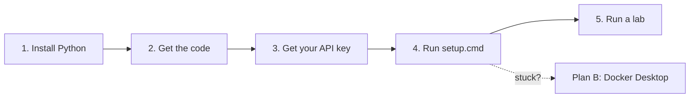

# 🪟 Windows Setup Guide

This guide is for students on **Windows 10 or 11**. It assumes you've **never used a terminal before**. Follow the steps in order; the whole thing takes about **20 minutes**, and you only do it once.

> On a Mac or Linux? Use the [Student Guide](STUDENT_GUIDE.md#1-one-time-setup) instead.



## Contents

1. [Install Python](#step-1-install-python)
2. [Get the course code](#step-2-get-the-course-code)
3. [Get your API key](#step-3-get-your-api-key)
4. [Run the setup](#step-4-run-the-setup)
5. [Run a lab](#step-5-run-a-lab)
6. [Edit code with VS Code](#step-6-edit-code-with-vs-code-recommended)
7. [Plan B: Docker Desktop](#plan-b-docker-desktop)
8. [Troubleshooting](#troubleshooting)
9. [Cheat sheet](#cheat-sheet)

---

## Before you start: a 2-minute terminal crash course

A **terminal** is a window where you type commands. On Windows it's called **PowerShell**.

**To open it:** press the **Windows key**, type `PowerShell`, and click **Windows PowerShell**. On Windows 11 you can also open **Terminal**, which runs PowerShell inside.

You'll see something like this. The part before `>` is the folder you're "in":

```text
PS C:\Users\yourname>
```

| To… | Type | Example |
|---|---|---|
| See which folder you're in | `pwd` | |
| List the files here | `dir` | |
| Go into a folder | `cd foldername` | `cd Downloads` |
| Go back up one folder | `cd ..` | |
| Go straight to your home folder | `cd $HOME` | |
| Stop a running program | **Ctrl+C** | |
| Reuse a previous command | **↑** (up arrow) | |
| Complete a folder or file name | type a few letters, then **Tab** | `cd 5350` + Tab |

**Pasting:** **Ctrl+V** works in Windows Terminal and Windows 11. In the older blue PowerShell window, **right-click** to paste.

> ⚠️ When this guide shows a command in a grey box, type or paste **only the command**. Don't include `PS C:\...>`.

---

## Step 1: Install Python

1. Go to <https://www.python.org/downloads/windows/> and click the big yellow **Download Python 3.x** button (any version **3.10 or newer**).
2. Open the downloaded installer.
3. ⚠️ **On the first screen, tick the box "Add python.exe to PATH".** This is the most common setup mistake, so don't skip it.
4. Click **Install Now** and wait until it says *Setup was successful*. If it offers to **"Disable path length limit"**, click it.
5. **Close any open PowerShell windows** and open a new one, so it sees the new Python.
6. Check that it worked:
   ```powershell
   py --version
   ```
   ✅ You should see `Python 3.12.x` (or similar).
   ❌ If you see *"not recognized"*, go to [Troubleshooting](#troubleshooting).

<details>
<summary>Why does Microsoft Store sometimes open when I type <code>python</code>?</summary>

Windows ships a fake `python` shortcut that opens the Store. Turn it off: **Settings → Apps → Advanced app settings → App execution aliases** (on Windows 10: **Settings → Apps → Apps & features → App execution aliases**) and switch **off** both `python.exe` and `python3.exe`. The course scripts use `py` first, so this rarely matters, but it avoids confusion.

</details>

---

## Step 2: Get the course code

### Where to put it

Put the course folder somewhere **simple and local**, such as `C:\Users\yourname\5350-chatbot`.

> ⚠️ **Avoid OneDrive folders.** On many Windows laptops, *Desktop* and *Documents* are synced to OneDrive. Syncing the thousands of small files in `.venv` makes setup slow and can break it. Avoid paths with unusual characters, too. Your home folder (`C:\Users\yourname`) is the safest choice.

### Option A: download a ZIP (easiest, no extra software)

1. Go to <https://github.com/iportilla/5350-chatbot>.
2. Click the green **Code** button, then **Download ZIP**.
3. In File Explorer, open **Downloads**, right-click `5350-chatbot-main.zip`, choose **Extract All…**, and set the destination to `C:\Users\yourname`.
4. Rename the extracted folder from `5350-chatbot-main` to `5350-chatbot`.

> If your instructor updates the labs later, download the ZIP again into a new folder and copy your own work across.

### Option B: git (if you want updates with one command)

1. Install **Git for Windows** from <https://git-scm.com/download/win>. The default options are fine.
2. In a **new** PowerShell window:
   ```powershell
   cd $HOME
   git clone https://github.com/iportilla/5350-chatbot.git
   ```
3. Later, to get updates: `cd $HOME\5350-chatbot` then `git pull`.

### Go into the folder

Every command from here on runs **inside the course folder**:
```powershell
cd $HOME\5350-chatbot
dir
```
✅ You should see `labs`, `lectures`, `scripts`, `README.md`, `run.py`…

---

## Step 3: Get your API key

Your instructor will tell you whether to use a **class key** or create your own at <https://platform.openai.com/api-keys> (*Create new secret key*).

The key starts with `sk-`. **Treat it like a password:** don't email it, post it or put it in screenshots. Copy it now; you'll paste it in the next step.

---

## Step 4: Run the setup

In PowerShell, inside the course folder:

```powershell
scripts\setup.cmd
```

*(Or, in File Explorer: open the `scripts` folder and **double-click `setup.cmd`**.)*

What happens:

1. It finds Python and creates a private environment in a folder called `.venv`.
2. It installs the packages. **This takes 2–5 minutes.** It may look stuck; it isn't.
3. It asks for your key:
   ```text
   OPENAI_API_KEY: ****
   ```
   **Paste your key** (Ctrl+V or right-click) and press **Enter**. The characters are hidden on purpose.
4. It runs a check. ✅ Success looks like:
   ```text
     [ OK ] Python 3.12.4
     [ OK ] Running inside the course environment (.venv or Docker)
     [ OK ] package 'openai' installed
     ...
     [ OK ] OPENAI_API_KEY looks valid (sk-...a1b2)

   All good! You are ready for Lab 1.
   ```

Want to confirm the key really works? This makes one tiny API call (a fraction of a cent):
```powershell
scripts\run.cmd check --ping
```

> 🔁 **Safe to re-run.** If anything goes wrong, fix it and run `scripts\setup.cmd` again. It skips the steps that are already done.
> 🧹 **Start over completely:** delete the `.venv` folder (and `.env` if you want to re-enter your key), then run setup again.

---

## Step 5: Run a lab

Always from the course folder (`cd $HOME\5350-chatbot`):

| Lab | Command |
|---|---|
| List everything | `scripts\run.cmd` |
| Check setup | `scripts\run.cmd check` |
| Lab 1, terminal chatbot | `scripts\run.cmd lab1` |
| Lab 1, web chatbot | `scripts\run.cmd lab1-web` |
| Lab 2, memory | `scripts\run.cmd lab2` |
| Lab 3, BloomBot | `scripts\run.cmd lab3` |
| Lab 4, PizzaBot Part A / Part B | `scripts\run.cmd lab4` / `scripts\run.cmd lab4b` |
| Lab 5, reasoning agent | `scripts\run.cmd lab5` |
| Lab 5, tests | `scripts\run.cmd test` |
| Lab 6, voice bot | `scripts\run.cmd lab6` |

### Terminal labs (Lab 1)
You chat right in PowerShell. Type `quit` to exit.

### Web labs (Labs 2–6, `lab1-web`)
1. Run the command. When you see `You can now view your Streamlit app in your browser`, open **<http://localhost:8501>** (it may open automatically).
2. **Leave the PowerShell window open** while you use the app. Closing it stops the app.
3. **Windows Firewall** may ask whether Python can use the network. Click **Allow** (private networks), or **Cancel**: `localhost` works either way.
4. **To stop:** click the PowerShell window and press **Ctrl+C**. If it asks `Terminate batch job (Y/N)?`, type `Y` and press Enter.

> Port 8501 already in use? Add a different port: `scripts\run.cmd lab2 --server.port 8502`, then open <http://localhost:8502>.

---

## Step 6: Edit code with VS Code (recommended)

1. Install **Visual Studio Code**: <https://code.visualstudio.com/>. During install, tick **"Add 'Open with Code' action"**.
2. In File Explorer, right-click the `5350-chatbot` folder → **Open with Code**. If asked, click **"Yes, I trust the authors"**.
3. Install the **Python** extension when VS Code suggests it.
4. Open a terminal inside VS Code: **Terminal → New Terminal**. It opens **already in the course folder**, so you can run `scripts\run.cmd lab2` there directly.
5. Edit a file and save (**Ctrl+S**). In the browser, click **Rerun** (top-right of the Streamlit page) to see the change.

**Notebooks** (`first_call.ipynb`): open the file, click **Select Kernel** (top-right) → **Python Environments** → choose the one in `.venv`.

### Editing `.env` safely
`.env` holds your key. To change it, open it in VS Code, or run `notepad .env` in PowerShell.

> ⚠️ **Notepad trap:** if you create the file yourself in Notepad, it may save it as `.env.txt`, which won't work. In File Explorer, turn on **View → Show → File name extensions** (Windows 11) or **View → File name extensions** (Windows 10) and make sure the name is exactly `.env`.

---

## Plan B: Docker Desktop

Use this if Python setup keeps failing (for example on a locked-down laptop), or if your instructor asks you to. Docker runs the labs inside a ready-made Linux box; you still edit files normally on Windows.

1. Install **Docker Desktop**: <https://www.docker.com/products/docker-desktop/>. Keep **"Use WSL 2"** ticked. Restart if asked.
2. Start Docker Desktop and wait until it shows **Engine running**.
3. In PowerShell, in the course folder, create your `.env`:
   ```powershell
   copy .env.sample .env
   notepad .env
   ```
   Replace `sk-...` with your key (keep the quotes) and save.
4. Build the course image (first time only, about 2–3 minutes):
   ```powershell
   docker compose build
   ```
5. Check your setup:
   ```powershell
   docker compose run --rm labs python run.py check
   ```
6. Run a lab (swap `lab2` for any lab name from Step 5):
   ```powershell
   docker compose run --rm --service-ports labs python run.py lab2
   ```
   Open <http://localhost:8501>, and stop with **Ctrl+C**.

| Task | Docker command |
|---|---|
| Lab 1 (terminal) | `docker compose run --rm labs python run.py lab1` |
| Any web lab | `docker compose run --rm --service-ports labs python run.py lab3` |
| Lab 5 tests | `docker compose run --rm labs python run.py test` |
| A shell inside the container | `docker compose run --rm labs bash` |
| Use port 8502 instead | `$env:PORT=8502; docker compose run --rm --service-ports labs python run.py lab2` |

> `make` commands (`make docker-lab2`) are for Mac/Linux. On Windows, use the `docker compose` commands above. They do exactly the same thing.

---

## Troubleshooting

**First step for any problem:** run `scripts\run.cmd check` and read the `[FAIL]` lines. They say how to fix most issues.

| What you see | Fix |
|---|---|
| `'py' is not recognized` or `'python' is not recognized` | Python isn't installed or isn't on PATH. Re-run the Python installer → **Modify** → make sure **py launcher** and **Add Python to environment variables** are ticked. Then **close and reopen PowerShell** |
| The Microsoft Store opens when setup runs | Turn off the `python.exe` / `python3.exe` **App execution aliases** (see Step 1) |
| `ERROR: Python 3.10 or newer was not found` | You have an older Python. Install a newer one from python.org (Step 1) |
| `running scripts is disabled on this system` | You ran a `.ps1` file directly. Use the `.cmd` versions instead: `scripts\setup.cmd`, `scripts\run.cmd` |
| `The term 'scripts\setup.cmd' is not recognized` / `cannot find path` | You're not in the course folder. Run `cd $HOME\5350-chatbot` (or wherever you put it) and `dir` to check |
| `The course environment isn't set up yet` | Run `scripts\setup.cmd` first |
| Setup is very slow or fails with "Access is denied" | Usually OneDrive or antivirus. Move the folder out of OneDrive (to `C:\Users\yourname\5350-chatbot`), delete `.venv`, and run setup again |
| `[FAIL] OPENAI_API_KEY is empty or still the placeholder` | Run `notepad .env` and paste your key between the quotes: `OPENAI_API_KEY="sk-..."` |
| `[FAIL] .env file not found` but you created one | It's probably `.env.txt`. Turn on file name extensions (Step 6) and rename it |
| `AuthenticationError` / 401 | The key is wrong or revoked. Paste a fresh one into `.env` |
| `RateLimitError` / 429 / `insufficient_quota` | No credit on the account, or too many requests. Wait a minute, or ask your instructor |
| The browser says *"This site can't be reached"* | The app isn't running (check the PowerShell window for errors), or you used the wrong port. Use `http://localhost:8501`, not the `0.0.0.0` or `Network URL` address |
| `Port 8501 is already in use` | Another lab is still running in another window. Close it with Ctrl+C, or use `--server.port 8502` |
| Lab 6: no microphone | **Settings → Privacy & security → Microphone**: turn on microphone access and allow your browser. Use Chrome or Edge |
| Lab 6: no sound | Click anywhere on the page first (browsers block autoplay until you interact) |
| Packages fail to install behind a school or company network | Try another network (e.g. a phone hotspot), or ask IT about a proxy. Docker (Plan B) has the same network needs |
| Docker: `error during connect` / `cannot find the file specified` | Docker Desktop isn't running. Start it and wait for **Engine running** |
| Docker: `WSL 2 installation is incomplete` | Open PowerShell **as Administrator**, run `wsl --install`, restart, then start Docker Desktop again |

When you ask for help, send: **which lab and step, the command you ran, and the full error text** (copy and paste it, don't retype it). Also send the output of `scripts\run.cmd check`, which hides your key. **Never send your key itself.**

---

## Cheat sheet

```powershell
cd $HOME\5350-chatbot          # always start here
scripts\setup.cmd              # one-time setup (safe to re-run)
scripts\run.cmd check --ping   # is everything working?
scripts\run.cmd lab2           # run a lab (lab1, lab1-web, lab2 … lab6, test)
notepad .env                   # change your API key
# Ctrl+C                       # stop a running lab (answer Y if asked)
```

<details>
<summary>Advanced: the manual way (what the scripts do for you)</summary>

```powershell
cd $HOME\5350-chatbot
py -3 -m venv .venv
.venv\Scripts\python.exe -m pip install -r requirements.txt
copy .env.sample .env ; notepad .env

# Activate the environment (once per terminal window)
.venv\Scripts\Activate.ps1
#   If blocked: Set-ExecutionPolicy -Scope CurrentUser RemoteSigned   (then try again)

cd labs\lab-02-memory
streamlit run memory_bot.py
```

While the environment is active, your prompt starts with `(.venv)`. Labs 2–6 must be started from **inside** their own folder. The launcher (`scripts\run.cmd`) handles that for you.

</details>
