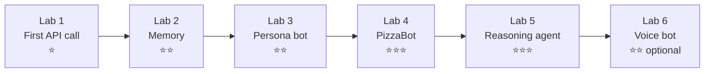

# Labs

Six self-contained labs. Each folder has its own `README.md` with objectives, steps, ✅ checkpoints, deliverables and stretch goals.

| Lab | Lecture | Time | Concept | You write |
|---|---|---|---|---|
| [1: First API call](lab-01-first-api-call/) | 1 | 45 min | Chat completions, roles, statelessness | A persona; temperature experiment |
| [2: Memory](lab-02-memory/) | 1 | 45 min | Session state, token growth, context limits | `trim_history()` sliding window |
| [3: Persona bot](lab-03-persona-bot/) | 1 | 60 min | System prompts, few-shot, temperature, fallback | A hardened `SYSTEM_PROMPT` |
| [4: PizzaBot](lab-04-pizza-bot/) | 2 | 75 min | Slot filling, FSM vs LLM, JSON extraction, validation | FSM order flow; LLM extraction + `validate()` |
| [5: Reasoning agent](lab-05-reasoning-agent/) | 2 | 75 min | Tool calling, ReAct loop, termination, testing | New tools + property test |
| [6: Voice bot](lab-06-voice-bot/) | 2 | 45 min | STT → LLM → TTS cascade, latency | Latency instrumentation; voice persona |

**Before Lab 1:** finish the [one-time setup](../guides/STUDENT_GUIDE.md#1-one-time-setup).

**Running any lab** (from the `5350-chatbot` folder):

| Windows | macOS / Linux | Docker |
|---|---|---|
| `scripts\run.cmd lab2` | `make lab2` | `make docker-lab2` |

Targets: `lab1`, `lab1-web`, `lab2`, `lab3`, `lab4`, `lab4b`, `lab5`, `lab6`, `test`, `check`.
