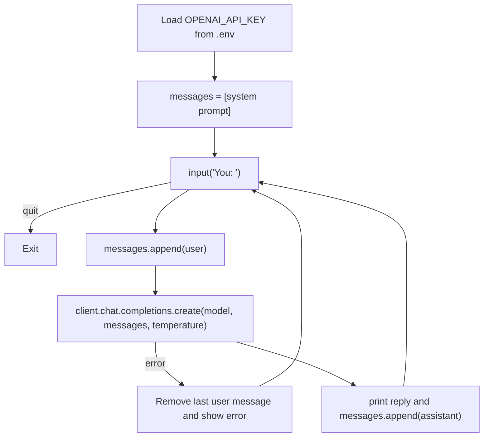

# Lab 1: Your First LLM API Call

**Lecture:** [1](../../lectures/lecture-01-llm-chatbot-foundations.md) · **Time:** about 45 min · **Difficulty:** ⭐

## Goal

Send messages to an LLM from Python, understand the request and response, and build a terminal chatbot that holds a conversation.

## Learning objectives

- Load an API key safely from `.env`
- Call `client.chat.completions.create` and read `choices[0].message.content` and `usage`
- Use the `system`, `user` and `assistant` roles
- See for yourself that **the API is stateless**

## Files

| File | What it does |
|---|---|
| `first_call.ipynb` | One request, one response, with each parameter explained |
| `cli_chat.py` | A terminal chatbot that keeps history in a Python list |
| `web_chat.py` | A Streamlit chatbot that sends **only the latest message** (no memory, on purpose) |
| `azure_cli_chat.py` | Optional: the same idea using Azure OpenAI |

## How it works



## Steps

### Step 0: Setup (once for the whole course)
Follow the [Student Guide setup](../../guides/STUDENT_GUIDE.md#1-one-time-setup). Make sure `.env` in the repo root contains `OPENAI_API_KEY=...`.

### Step 1: One call in a notebook
Open `first_call.ipynb` and run every cell.
- ✅ **Checkpoint:** you see "Buenos Aires" (or similar) printed.
- Look at the response object. Find `usage.prompt_tokens` and `usage.completion_tokens`.

### Step 2: Terminal chatbot
```bash
python labs/lab-01-first-api-call/cli_chat.py
```
Chat for a few turns. Tell it your name, then ask for it back.
- ✅ **Checkpoint:** the bot remembers your name. **Why?** Find the line in `cli_chat.py` that makes this happen.

### Step 3: Change the persona
In `cli_chat.py`, swap the system message for one from the comment list (pirate, Shakespeare, sarcastic chef…), or write your own. Run it again.
- ✅ **Checkpoint:** the tone changes completely, and you changed only one string.

### Step 4: Web chatbot with no memory
```bash
streamlit run labs/lab-01-first-api-call/web_chat.py
```
Tell it your name, then ask "What's my name?".
- ✅ **Checkpoint:** it **doesn't** know. Compare the `messages=[...]` passed in `web_chat.py` with the one in `cli_chat.py`. Write one sentence explaining the difference.

### Step 5: Experiment with temperature
In `cli_chat.py`, ask "Write a one-line slogan for a coffee shop" three times at `temperature=0`, then three times at `temperature=1.5`. Record what you see.

## Deliverables

1. A screenshot of `cli_chat.py` with your custom persona.
2. Your answer from Step 4: why does the web bot forget?
3. A small table of the 6 slogans from Step 5, plus one sentence on what temperature did.

## Stretch goals

- Print `response.usage` after each turn in `cli_chat.py`. How does `prompt_tokens` change as the chat grows?
- Make `web_chat.py` show the previous messages on screen (it still won't *remember* them; that's Lab 2).
- If you have Azure access, run `azure_cli_chat.py` and compare. What's different in the client setup?

## Troubleshooting

| Symptom | Fix |
|---|---|
| `Missing OPENAI_API_KEY` | `.env` is missing, misnamed or in the wrong folder. Run from the repo root, or put `.env` next to the script |
| `AuthenticationError 401` | The key is wrong or revoked. Make a new one |
| `RateLimitError 429` / `insufficient_quota` | Your account has no credit. Ask your instructor |
| `ModuleNotFoundError: openai` | Activate your venv: `source .venv/bin/activate` |
