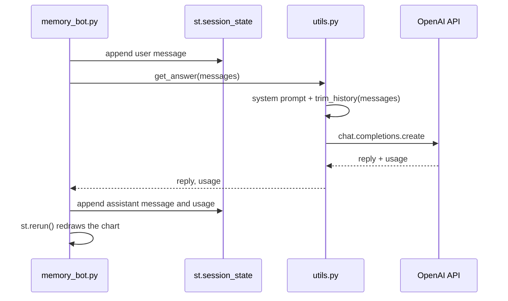

# Lab 2: A Chatbot With Memory

**Lecture:** [1](../../lectures/lecture-01-llm-chatbot-foundations.md) · **Time:** about 45 min · **Difficulty:** ⭐⭐

## Goal

Give a web chatbot **conversation memory**, measure how memory makes each request **grow**, and limit that growth with a **sliding window**.

## Learning objectives

- Store state across Streamlit reruns with `st.session_state`
- Keep the **UI** (`memory_bot.py`) separate from the **logic** (`utils.py`)
- Watch prompt tokens grow turn by turn
- Implement history trimming, and see what the bot forgets as a result

## Files

| File | Layer | What it does |
|---|---|---|
| `memory_bot.py` | UI | Chat window, session state, token chart in the sidebar |
| `utils.py` | Logic | `get_answer()` adds the system prompt and calls the API. `trim_history()` is **your TODO** |

## How it works



## Steps

### Step 1: Run it
```bash
cd labs/lab-02-memory
streamlit run memory_bot.py
```
- ✅ **Checkpoint:** tell it your name, then ask for it 3 turns later. It remembers.

### Step 2: Break it on purpose
In `memory_bot.py`, temporarily change `get_answer(st.session_state.messages)` to `get_answer(st.session_state.messages[-1:])`. Run the name test again, then **undo the change**.
- ✅ **Checkpoint:** explain in one sentence where the bot's "memory" actually lives.

### Step 3: Measure growth
Have a 10-turn conversation. Watch the **Prompt size per turn** chart in the sidebar.
- ✅ **Checkpoint:** the line goes up every turn. Write down the prompt tokens at turns 1, 5 and 10.

### Step 4: Implement a sliding window (code task)
Open `utils.py` and implement `trim_history(messages, max_messages=10)` so it returns only the **last `max_messages`** messages.
Set `max_messages=4` to make the effect easy to see, then repeat Step 3.
- ✅ **Checkpoint:** the chart flattens out after a few turns.
- ✅ **Checkpoint:** tell the bot your name on turn 1, chat for 5 turns, then ask for it. It's forgotten. That's the trade-off.

### Step 5: Reflect
Why is the system prompt added in `get_answer()` *outside* the trimmed history?

## Deliverables

1. Your `trim_history()` code.
2. Two screenshots of the token chart, one **before** and one **after** trimming.
3. Short answers: (a) where memory lives, (b) what trimming cost you, (c) the Step 5 question.

## Stretch goals

- **Summarize instead of dropping:** when history exceeds the window, replace old turns with one LLM-generated summary message.
- **Pinned facts:** detect "my name is X" and keep it in `st.session_state.user_name`, then add it to the system prompt.
- Add a **Download transcript** button (`st.download_button`) that saves the chat as JSON.

## Troubleshooting

| Symptom | Fix |
|---|---|
| `ImportError: cannot import name 'get_answer'` | Run `streamlit` from inside `labs/lab-02-memory/` |
| `AttributeError: st.experimental_rerun` | You're on old code. Use `st.rerun()` |
| The chart doesn't appear | It shows after the first assistant reply |
