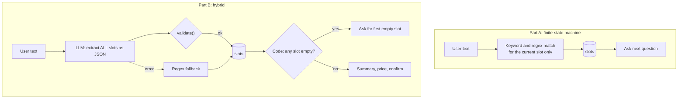
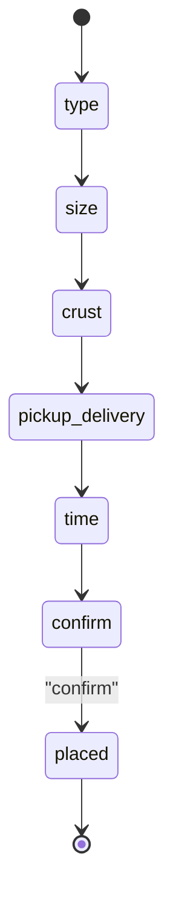

# Lab 4: PizzaBot 🍕: Goal-Oriented Dialog, From Rules to LLM

**Lecture:** [2](../../lectures/lecture-02-goal-oriented-bots-and-agents.md) · **Time:** about 75 min · **Difficulty:** ⭐⭐⭐

## Goal

Build a bot that **finishes a task**: taking a complete pizza order. First you'll build it with deterministic rules (Part A). Then you'll upgrade it so an **LLM extracts the order details** while **your code stays in control** (Part B).

## Learning objectives

- Model a conversation as **slots + dialog policy** (a finite-state machine)
- Extract entities with **keywords and regex**, and see where they break
- Use an LLM for **structured JSON extraction** (`response_format={"type": "json_object"}`, temperature 0)
- **Validate** model output against allowed values
- Design a **fallback** for when the LLM fails

## Files

| File | Part | What it does |
|---|---|---|
| `starter/app_pizza_bot.py` | A | Minimal starter: system prompt, sidebar, `generate_reply()` TODOs |
| `starter/app_pizza_bot_llm.py` | B | Hybrid bot. UI, regex fallback and dialog policy are done; **TODO B1–B3** |
| `starter/menu.json` | B | The menu (names and prices). The single source of truth for valid pizzas |

## The two designs





---

## Part A: rules-based PizzaBot (about 30 min)

```bash
cd labs/lab-04-pizza-bot/starter
streamlit run app_pizza_bot.py
```

1. **System prompt:** replace `SYSTEM_PROMPT` with a friendly PizzaBot personality.
2. **Quick actions:** add sidebar buttons (🍕 Pepperoni, 🥦 Veggie, 🌶️ Spicy, 🎉 Party order) that send a message, like BloomBot's `send_message()` in Lab 3.
3. **Slot filling:** replace `generate_reply()` with a rules-based order flow:
   - Keep `st.session_state.order = {"type": None, "size": None, "crust": None, "pickup_delivery": None, "time": None}`
   - On each turn, try to fill the **first empty slot** with keywords or regex, for example `re.search(r"\b(small|medium|large)\b", text)`
   - Reply with the question for the next empty slot. When all slots are full, ask the user to **confirm**
4. **Test** with the "happy path": `pepperoni` → `large` → `thin` → `delivery` → `7pm` → `confirm`.
   - ✅ **Checkpoint:** the order completes.
5. **Break it.** Type the whole order in one sentence: *"A large veggie on thin crust, delivered at 7pm."*
   - ✅ **Checkpoint:** write down what goes wrong, and why.

## Part B: hybrid LLM PizzaBot (about 45 min)

```bash
streamlit run app_pizza_bot_llm.py
```
It already runs. Because TODO B2 raises `NotImplementedError`, every turn falls back to regex (you'll see a toast). The sidebar shows the live **order slots**.

- **TODO B1: extraction prompt.** Write `EXTRACTION_PROMPT`. List each key, its allowed values (use `PIZZA_NAMES`), and the rule "use null if not mentioned; never invent values".
- **TODO B2: LLM call.** Implement `extract_slots_llm(text)` with `temperature=0` and `response_format={"type": "json_object"}`, parse it with `json.loads`, and return `validate(data)`.
- **TODO B3: validation.** Implement `validate(data)` so it keeps only known slots with allowed values.

Test script:

| # | You type | Expected |
|---|---|---|
| 1 | A large veggie on thin crust, delivered at 7pm | All 5 slots filled in **one** turn; summary with price (even the regex fallback manages this one) |
| 2 | *(New order)* I'd like a big one loaded with vegetables, crispy thin base, bring it to my place around seven tonight | **LLM:** all 5 slots filled. **Regex fallback:** only `crust`. This is why we use an LLM |
| 3 | actually make it medium | Only `size` changes |
| 4 | *(New order)* I want a Hawaiian | `type` stays empty (not on the menu); bot asks for the type |
| 5 | *(Finish any order)* confirm | Order placed; further messages don't reopen it |

- ✅ **Checkpoint:** all 5 rows behave as expected. The italic note under each reply says `understood via LLM`.
- ✅ **Checkpoint:** set `OPENAI_API_KEY` to an invalid value in `.env`, restart, and run test 2 again. The bot keeps working via the regex fallback, but it understands much less. Restore your key.

## Deliverables

1. Part A: your `app_pizza_bot.py` and a screenshot of a completed happy-path order.
2. Part B: your `app_pizza_bot_llm.py` and a screenshot of test 1 showing all slots filled at once.
3. Reflection (about 200 words):
   - Why is extraction run at **temperature 0**?
   - What does `validate()` protect you from? Give a concrete example.
   - In Part B, **who decides** when the order is complete, the LLM or your code? Why does that matter?

## Stretch goals

- Add a `quantity` slot and compute a total from `menu.json`.
- Add an **intent** field to the extraction (`order`, `menu_question`, `human`). Answer menu questions from `menu.json` without changing slots.
- Show a styled receipt after confirmation (see `render_receipt()` in the instructor's FSM solution).
- Use the API's `json_schema` structured-output mode instead of `json_object`.

## Troubleshooting

| Symptom | Fix |
|---|---|
| Toast "LLM unavailable, using regex fallback" | Expected until B2 is done. Afterwards, check your key and the terminal error |
| `json.JSONDecodeError` | JSON mode requires the word "JSON" in your prompt. Check B1 |
| The slot fills with a weird value | Your `validate()` isn't filtering. Check against the allowed lists |
| `AttributeError: st.experimental_rerun` | Use `st.rerun()` |
