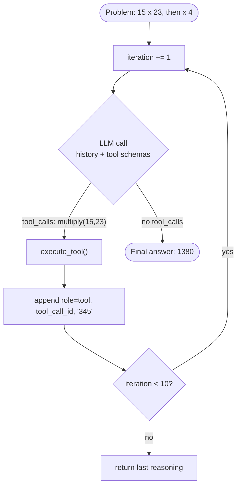
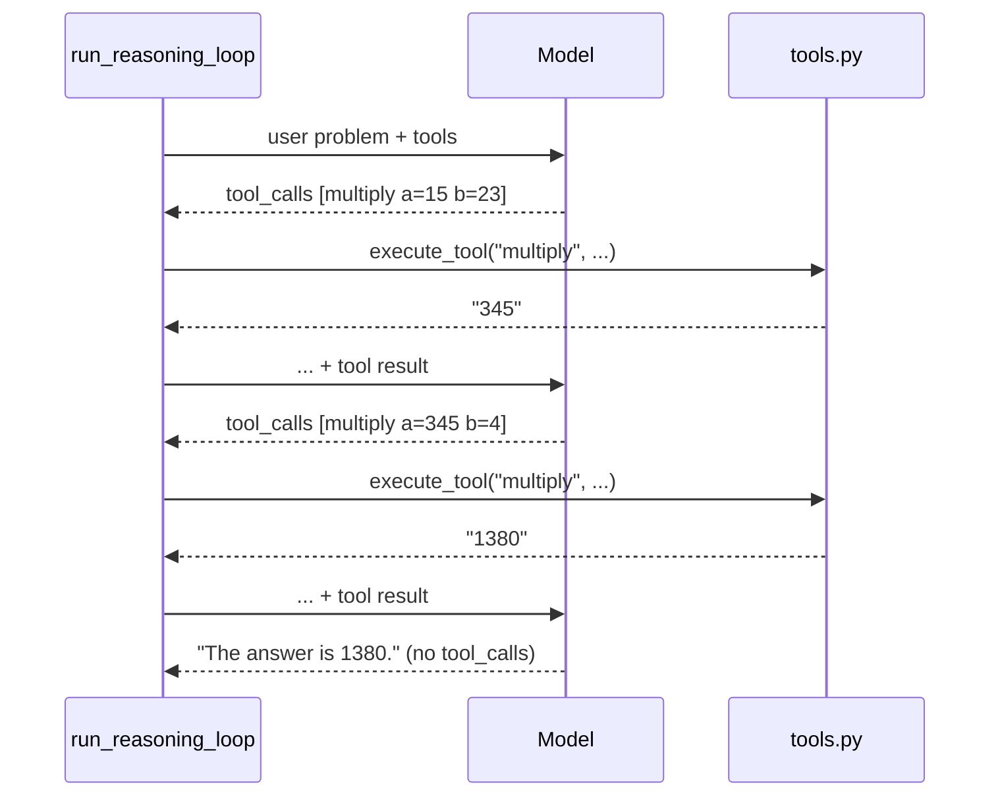

# Lab 5: A Tool-Using Reasoning Agent 🧮

**Lecture:** [2](../../lectures/lecture-02-goal-oriented-bots-and-agents.md) · **Time:** about 75 min · **Difficulty:** ⭐⭐⭐

## Goal

Run, read and **extend** an agent that solves math problems by calling tools inside a **ReAct loop** (Reason → Act → Observe → repeat).

## Learning objectives

- Describe a tool to the model with **JSON Schema**
- Follow the **tool-calling protocol**: `tool_calls` → run → `role: "tool"` + `tool_call_id`
- Explain why the loop needs **`max_iterations`**
- Add new tools, and handle tool errors safely
- Test agent code **without** calling the API (mocks + property-based tests)

## Files

```
lab-05-reasoning-agent/
├── app.py                         # Streamlit UI: chat + expandable reasoning steps
├── reasoning_agent/
│   ├── reasoning_agent.py         # ⭐ the ReAct loop: run_reasoning_loop()
│   ├── tools.py                   # ⭐ tool code, JSON schemas, execute_tool() router
│   ├── utils.py                   # formatting helpers
│   └── test_*.py                  # unit and property tests (mocked API)
├── test_integration.py            # end-to-end tests (mocked API)
└── bonus_langgraph_math_agent.ipynb   # the same idea with LangGraph's prebuilt agent
```

## How it works





## Steps

### Step 1: Run the agent
Run from the `5350-chatbot` folder:

| Windows | macOS / Linux | Docker |
|---|---|---|
| `scripts\run.cmd lab5` | `make lab5` | `make docker-lab5` |

Then open <http://localhost:8501>.
Try these and expand each reasoning step:
1. `What is 15 times 23?`
2. `A store sells 15 items per day. How many in 6 days?`
3. `What is 10 times 5, then multiply that result by 2?`
4. `What is 7 times 8, then add 10?`
5. `What is 100 divided by 7?`
- ✅ **Checkpoint:** for each problem, record the number of steps and the tools used. For 4 and 5 there's no add or divide tool. **What does the model do instead?** Is the answer trustworthy?

### Step 2: Read the loop
Open `reasoning_agent/reasoning_agent.py` and find:
- (a) where tool schemas are sent to the model
- (b) where `"type": "function"` is added to the replayed assistant message
- (c) where the tool result is appended, and with which `role`
- (d) the termination conditions
- ✅ **Checkpoint:** write the line numbers for (a)–(d).

### Step 3: Break the protocol (5 min, then undo)
Change `"role": "tool"` to `"role": "user"` (and delete the `tool_call_id` line). Run problem 1.
- ✅ **Checkpoint:** copy the error message. Explain it using the lecture's protocol diagram. **Undo your change.**

### Step 4: Add tools (main task)
In `reasoning_agent/tools.py`, add **`add`**, **`subtract`** and **`divide`**:
1. Write each Python function.
2. Add a JSON schema to `get_tool_definitions()` (a clear `description` matters: the model reads it).
3. Route each one in `execute_tool()`.
4. For `divide` by zero, **return** `"Error: cannot divide by zero"` instead of raising, so the model can recover.
5. Update the system prompt in `_initialize_system_prompt()` to mention the new tools.

Re-run problems 4 and 5, and try `What is 10 divided by 0?`
- ✅ **Checkpoint:** the reasoning steps now show `add` and `divide` being called, and the divide-by-zero case gets a sensible reply instead of crashing.

### Step 5: Test without spending tokens
Run from the `5350-chatbot` folder:

| Windows | macOS / Linux | Docker |
|---|---|---|
| `scripts\run.cmd test` | `make test` | `make docker-test` |
Then add a property test to `reasoning_agent/test_tools.py`:
```python
@given(a=st.floats(allow_nan=False, allow_infinity=False),
       b=st.floats(allow_nan=False, allow_infinity=False))
def test_add_correctness(a, b):
    assert float(execute_tool("add", {"a": a, "b": b})) == a + b
```
- ✅ **Checkpoint:** all tests pass. Open `test_reasoning_agent.py` and find how `OpenAI` is **mocked**. Why is this useful?

### Step 6: Termination
Set `self.max_iterations = 1` and run problem 3.
- ✅ **Checkpoint:** what answer do you get? Why must every agent loop have a cap? Restore it to 10.

## Deliverables

1. Your updated `tools.py` and system prompt.
2. Your Step 1 table (before tools) and the same table after Step 4.
3. The Step 3 error message and your explanation.
4. Passing `pytest` output, including your new test.
5. Reflection: *the model never runs your code. Where exactly is the security boundary in this agent, and what would you check there before adding a tool like `send_email` or `run_sql`?*

## Stretch goals

- Refactor `execute_tool()` into a **dictionary registry** (`{"add": add, ...}`) so adding a tool is one line.
- Add a non-math tool, e.g. `get_pizza_price(name)` that reads `../lab-04-pizza-bot/starter/menu.json`. Then ask "How much are 3 Spicy Diablos?"
- Show the **token cost** per problem in the UI (sum `response.usage` across iterations).
- Run `bonus_langgraph_math_agent.ipynb` and compare it with the hand-written loop. What does the framework hide from you?
- Read how this lab was **generated by an AI IDE** from a spec: [spec-driven development case study](../../resources/spec-driven-dev/how-kiro-built-lab-5.md).

## Troubleshooting

| Symptom | Fix |
|---|---|
| `OPENAI_API_KEY not found` | `.env` needs `OPENAI_API_KEY=...` (capital letters) |
| `ModuleNotFoundError: reasoning_agent` | Use `make lab5` / `make test` (or `scripts\run.cmd lab5` / `test`), which run from the right folder |
| `An assistant message with 'tool_calls' must be followed by tool messages` | Every tool call needs a matching `role: "tool"` message with its `tool_call_id` |
| `ModuleNotFoundError: hypothesis` | Run the setup script again |
