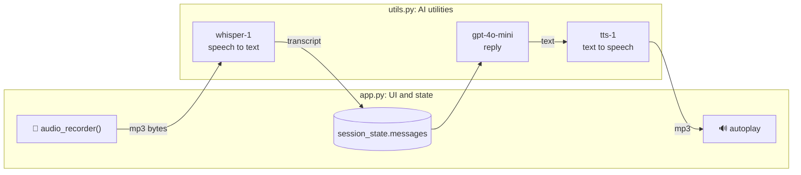

# Lab 6: A Voice Chatbot 🎤🔊 (optional or extra credit)

**Lecture:** [2](../../lectures/lecture-02-goal-oriented-bots-and-agents.md) · **Time:** about 45 min · **Difficulty:** ⭐⭐

## Goal

Build a **speech-in, speech-out** chatbot by chaining three models: Whisper (speech to text), GPT (reasoning) and TTS (text to speech).

## Learning objectives

- Build a **cascade** pipeline in which the data changes form (audio → text → text → audio)
- Keep the **UI and state** (`app.py`) separate from the **AI utilities** (`utils.py`)
- Measure the **latency** of each stage
- Handle temporary files and browser autoplay

## Files

| File | Layer | What it does |
|---|---|---|
| `app.py` | UI and state | Mic recorder (floating footer), chat history, spinners, file cleanup |
| `utils.py` | AI utilities | `speech_to_text()`, `get_answer()`, `text_to_speech()`, `autoplay_audio()` |

## How it works



## Steps

### Step 1: Run it
Use **Chrome** and allow microphone access.
```bash
cd labs/lab-06-voice-bot
streamlit run app.py
```
Click the mic, ask a question, and click again to stop.
- ✅ **Checkpoint:** your words appear as text, and the reply is read aloud.

### Step 2: Measure latency
Wrap each of the three calls in `app.py` with timing:
```python
import time
t0 = time.perf_counter(); transcript = speech_to_text(webm_file_path); stt_s = time.perf_counter() - t0
```
Show the timings with `st.caption(f"STT {stt_s:.2f}s · LLM {llm_s:.2f}s · TTS {tts_s:.2f}s")`.
- ✅ **Checkpoint:** record 3 runs. Which stage is slowest? How long is the total silence?

### Step 3: Give it a voice persona
- Change the `voice=` in `text_to_speech()` (try `alloy`, `echo`, `shimmer`).
- Change the system prompt in `get_answer()` to a voice-friendly persona: short sentences, no markdown, no bullet lists (they sound terrible read aloud).
- ✅ **Checkpoint:** explain why a voice bot's prompt needs to be different from a text bot's.

### Step 4: Combine with an earlier lab
Pick one:
- **BloomBot by voice:** use the Lab 3 `SYSTEM_PROMPT`.
- **Voice PizzaBot:** pass the transcript into your Lab 4 hybrid slot extraction.

## Deliverables

1. A short screen recording or screenshots of a voice conversation.
2. Your latency table (3 runs × 3 stages) and the slowest stage.
3. Your voice-friendly system prompt and your Step 3 explanation.

## Stretch goals

- Stream the LLM reply and start TTS on the first sentence to cut the perceived latency.
- Add a text-input fallback for users without a mic.
- Research speech-to-speech "realtime" models. How do they avoid the cascade?

## Troubleshooting

| Symptom | Fix |
|---|---|
| No audio plays | The browser blocked autoplay. Click anywhere on the page first, or use Chrome |
| Mic button does nothing | Grant mic permission. On macOS: System Settings → Privacy → Microphone → your browser |
| `ModuleNotFoundError: audio_recorder_streamlit` | `pip install -r requirements.txt` from the repo root |
| `temp_audio.mp3` files pile up | Make sure both `os.remove()` calls run (they're in `.gitignore` anyway) |
