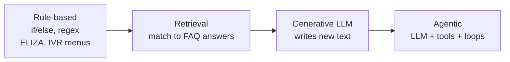
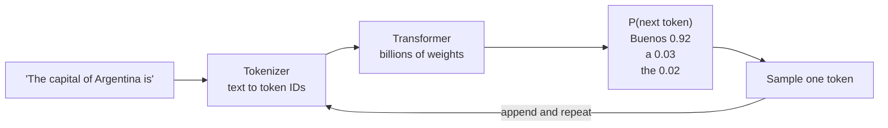
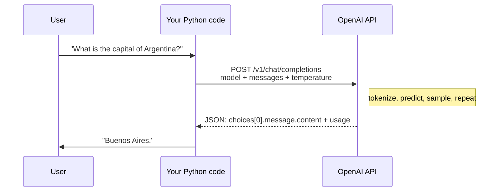
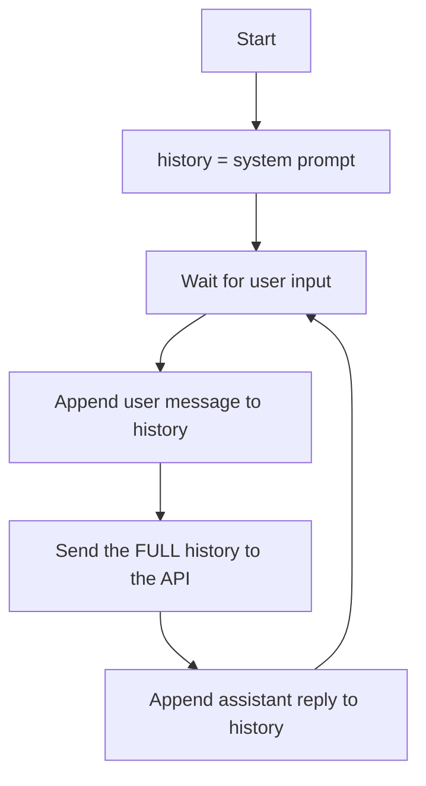
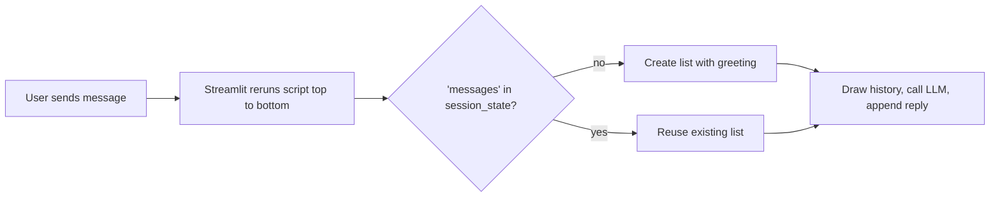
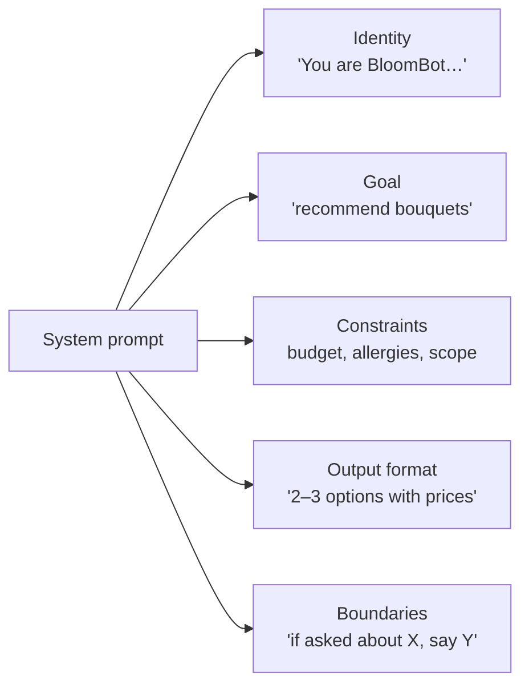
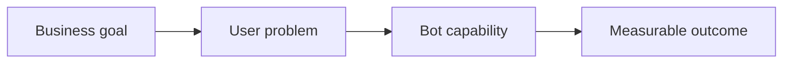

# Lecture 1: LLM-Driven Chatbots: From a Single API Call to a Conversation

**Length:** 75 minutes (plus lab time) · **Labs:** [1](../labs/lab-01-first-api-call/), [2](../labs/lab-02-memory/), [3](../labs/lab-03-persona-bot/) · **Next:** [Lecture 2](lecture-02-goal-oriented-bots-and-agents.md)

## Learning objectives

By the end of this lecture you should be able to:

1. Explain what an LLM does in **statistical terms**: it samples the next token from a probability distribution.
2. Describe the anatomy of a **chat completion request**: model, messages, roles and parameters.
3. Explain why LLM APIs are **stateless**, and how a chatbot fakes memory.
4. Predict how **temperature** and **top-p** change output, and choose settings for a given task.
5. Use a **system prompt** to turn a general model into a domain assistant.
6. Plan a chatbot from **business goals**, not features.

## Agenda

| Time | Segment | Lab link |
|---|---|---|
| 0–10 | 1. Why chatbots, and how they evolved | |
| 10–25 | 2. What an LLM actually does | |
| 25–35 | 3. Anatomy of an API call · **live demo** | Lab 1 |
| 35–50 | 4. Statelessness and memory · **live demo** | Lab 2 |
| 50–60 | 5. Sampling parameters | Lab 3 |
| 60–70 | 6. System prompts and personas | Lab 3 |
| 70–75 | 7. Planning your first chatbot · wrap-up | |

---

## 1. Why chatbots, and how they evolved

Chatbots are **business systems**: they exist to take away a user's pain (waiting on hold, digging through FAQs, filling in forms). The technology has gone through four stages:



| Stage | Strength | Weakness |
|---|---|---|
| Rule-based | 100% predictable, cheap | Breaks on anything unexpected |
| Retrieval | Answers are pre-approved | Can only say what is already written |
| Generative (LLM) | Flexible, fluent, handles open-ended language | Can make things up (hallucinate) and is non-deterministic |
| Agentic | Can *act* (look things up, calculate, place orders) | Hardest to make safe, test and keep cheap |

> **Key message:** these stages aren't replacements for each other. Good production bots *combine* them. You'll do this in Lab 4.

---

## 2. What an LLM actually does

A large language model is a function that takes a sequence of **tokens** and returns a **probability distribution over the next token**.



Ideas to land:

- **Tokens, not words.** A token is roughly ¾ of an English word. You pay per token, and limits are measured in tokens.
- **Context window.** This is the maximum number of tokens the model can "see" at once (prompt and answer combined). Anything outside it doesn't exist for the model.
- **Autoregressive generation.** The model writes one token at a time, and each new token is conditioned on everything before it.
- **Why hallucinations happen.** The model produces *plausible* continuations, not *verified* facts. A fluent wrong answer can still have high probability.

> 📊 **For statisticians:** generation is repeated sampling from a categorical distribution. The logits are turned into probabilities with a softmax. Temperature is a scale parameter on that softmax (Section 5).

---

## 3. Anatomy of a chat completion API call



```python
from openai import OpenAI
client = OpenAI()                      # reads OPENAI_API_KEY from the environment

response = client.chat.completions.create(
    model="gpt-4o-mini",
    messages=[
        {"role": "system", "content": "You are a helpful, concise assistant."},
        {"role": "user",   "content": "What is the capital of Argentina?"},
    ],
    temperature=0.7,
)
print(response.choices[0].message.content)
print(response.usage)                  # prompt_tokens, completion_tokens
```

**The three roles**

| Role | Who writes it | Purpose |
|---|---|---|
| `system` | Developer | Persona, rules, scope ("You are BloomBot, a florist…") |
| `user` | End user | The question or request |
| `assistant` | Model, or you when replaying history | Previous answers, so the model sees the conversation |

The same pattern works with other providers. Only the client changes: `AzureOpenAI(...)` (see `azure_cli_chat.py`) or IBM watsonx `ModelInference(...).chat(messages=...)` (see [resources/watsonx](../resources/watsonx/)).

🧪 **Live demo:** `python labs/lab-01-first-api-call/cli_chat.py`. Change the system prompt to "a pirate captain", then to "a Shakespearean assistant".

---

## 4. Statelessness and memory

**The API has no memory.** Every request is independent. To make a *conversation*, your code must store the history and **re-send all of it on every turn**.



🧪 **Live demo, part 1:** open `labs/lab-01-first-api-call/web_chat.py`. Say "My name is Ana", then ask "What's my name?". The bot doesn't know, because this app only sends the latest message.
🧪 **Live demo, part 2:** run `labs/lab-02-memory/memory_bot.py` and repeat the test. It remembers. Watch the token chart in the sidebar climb.

### The cost of memory

If each turn adds about *k* tokens, turn *n* sends about *n·k* prompt tokens. The **total** cost of an *N*-turn chat is therefore

$$\sum_{n=1}^{N} n\,k = k\,\frac{N(N+1)}{2} = O(N^2).$$

Long chats get expensive (and slow), and eventually they overflow the context window. Common strategies:

| Strategy | How it works | Trade-off |
|---|---|---|
| Sliding window | Keep only the last *m* messages | Forgets early facts (such as the user's name) |
| Summarization | Replace old turns with an LLM-written summary | Costs an extra call; the summary can be lossy |
| Pinned facts | Store key facts (name, order ID) in a structured slot | Needs extraction logic (Lecture 2) |
| Retrieval (RAG) | Store everything and fetch only what's relevant | More infrastructure |

### The UI layer: Streamlit's rerun model

Streamlit **re-runs your entire script** on every click or message. Ordinary variables get reset, so the history must live in `st.session_state`:



---

## 5. Sampling parameters: the knobs

| Parameter | What it does | Use low/off for | Use high for |
|---|---|---|---|
| `temperature` (0–2) | Sharpens (<1) or flattens (>1) the next-token distribution | Extraction, math, classification | Brainstorming, creative copy |
| `top_p` (0–1) | Samples only from the smallest set of tokens covering *p* of the probability | Factual answers | Variety |
| `max_tokens` | Hard cap on output length | Cost control, short answers | Long-form writing |
| `frequency_penalty` | Penalizes tokens in proportion to how often they've appeared | | Reducing repetition |
| `presence_penalty` | Penalizes any token that has already appeared | | Encouraging new topics |

$$P_T(\text{token}_i) = \frac{e^{z_i/T}}{\sum_j e^{z_j/T}}$$

As $T \to 0$ this becomes *argmax* (almost deterministic). Large $T$ moves it toward uniform.

> Rule of thumb: change **either** temperature **or** top-p, not both. See the [parameters handout](../resources/watsonx/LLM-Model-Parameters-Handout.md).

---

## 6. System prompts and personas

The system prompt is the cheapest, most powerful control you have. A good one covers:



**Prompting patterns** (from the watsonx module):

- **Zero-shot:** instructions only.
- **One-shot / few-shot:** include 1 or more example Q→A pairs, which strongly shapes the format.
- **Guardrails in the prompt:** state what the bot must *not* do, and when to hand off to a human.

**Limits:** a system prompt is a *strong suggestion*, not a security boundary. Users can try to talk the bot out of it ("ignore previous instructions…"). In Lecture 2 we'll enforce rules in **code**.

🧪 **Live demo:** `streamlit run labs/lab-03-persona-bot/bloom_bot.py`. Ask for a birthday bouquet, then ask it for a pasta recipe. Does it stay in scope?

---

## 7. Planning your first chatbot

Before writing code, answer these questions (full guide: [Planning Your First Chatbot](../resources/Planning_Your_First_Chatbot.md)):



1. **What should the bot do, and what should it *not* do?**
2. **When does a human take over?**
3. **What does success look like?** Make it SMART, e.g. "resolve 60% of order-status questions without an agent by May".
4. **Start simple:** rules → retrieval → hybrid → agentic. Earn the complexity.

---

## Key takeaways

1. An LLM is a **stateless next-token sampler**. Everything else is engineering around it.
2. **Memory = re-sending history**, and the cost grows quadratically with conversation length.
3. **Temperature** controls randomness. Use low for facts and extraction, higher for creativity.
4. **System prompts** create personas and scope, but they're not enforcement.
5. A chatbot is a **product**: start from goals and boundaries.

## Check your understanding

1. Why does the Lab 1 web chatbot forget your name, while the Lab 2 bot remembers it?
2. A 20-turn conversation adds about 100 tokens per turn. Roughly how many prompt tokens are sent *in total*?
3. You're extracting dates from emails. What temperature would you use, and why?
4. Give one thing a system prompt *can't* guarantee.
5. Name two ways to keep a long conversation within the context window.

<details><summary>Answers</summary>

1. The Lab 1 web app only sends the latest user message. Lab 2 stores history in `st.session_state` and re-sends all of it.
2. Σ 100·n for n = 1…20 = 100·210 = **21,000** tokens (about 2,000 on the final turn alone).
3. 0 (or close to it). You want the most likely, consistent answer, not variety.
4. That users can't override it (prompt injection), that facts are correct, or that the output format is exactly right.
5. A sliding window, summarization, pinned facts or retrieval.

</details>

## Discussion questions

- Where would you *not* want an LLM-driven chatbot? (Medical triage? Legal advice? Banking transfers?)
- If every user conversation is re-sent to a third-party API, what are the privacy implications?
- Is a "persona" honest? Should bots disclose that they're AI?

## Labs for this lecture

| Lab | Time | You'll build |
|---|---|---|
| [Lab 1: First API call](../labs/lab-01-first-api-call/) | 45 min | A terminal chatbot and a single-turn web chatbot |
| [Lab 2: Memory](../labs/lab-02-memory/) | 45 min | A Streamlit chatbot with history, token tracking and a sliding window |
| [Lab 3: Persona bot](../labs/lab-03-persona-bot/) | 60 min | BloomBot, a florist assistant tuned with system prompts and temperature |
