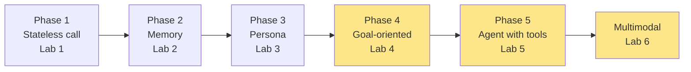
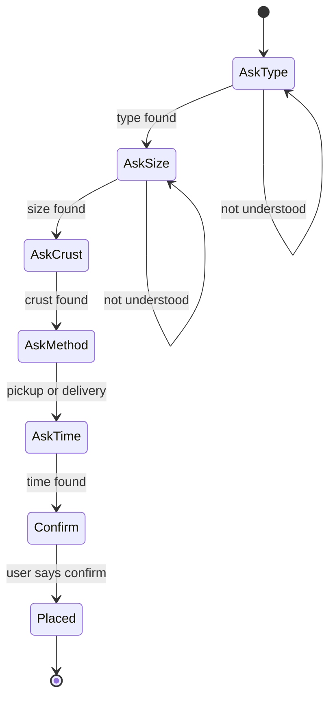
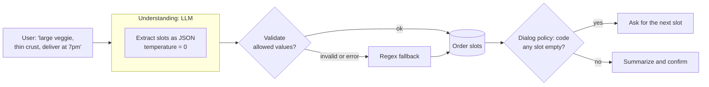
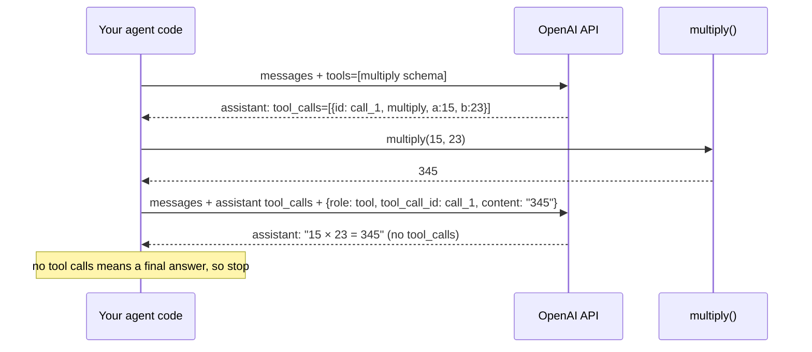
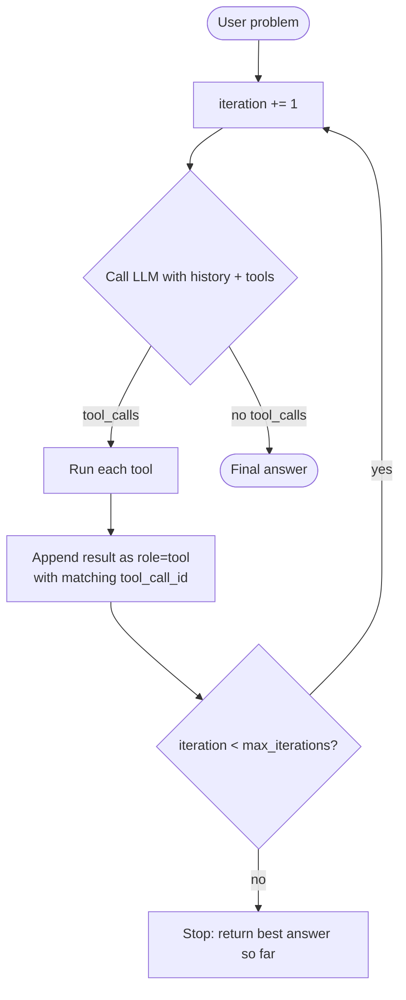
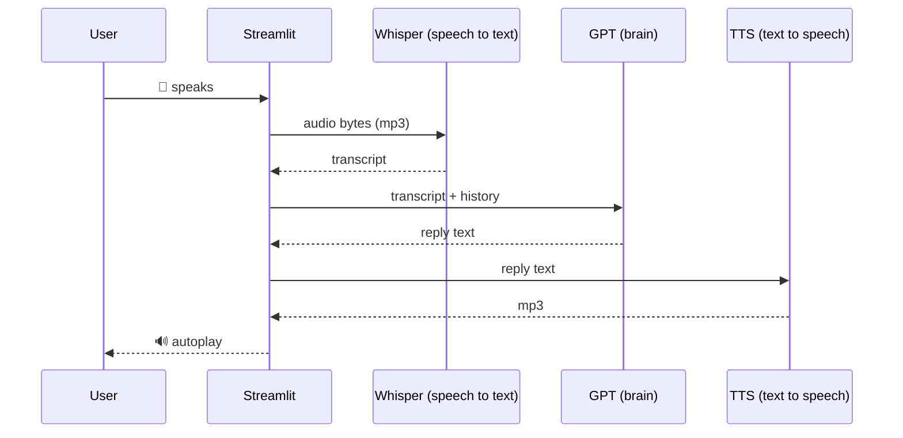
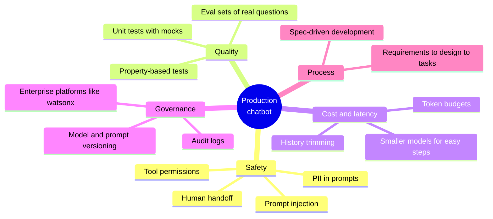
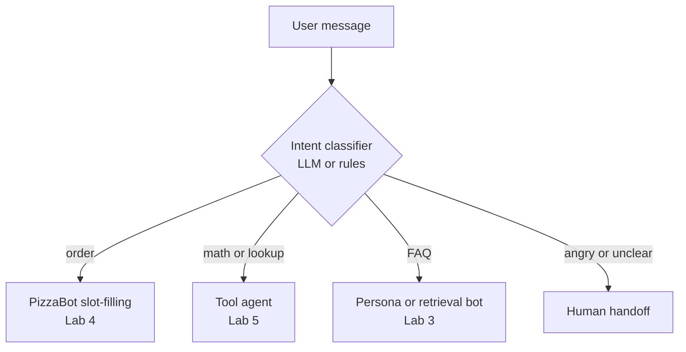

# Lecture 2: LLM-Driven Chatbots: From Conversation to Action

**Length:** 75 minutes (plus lab time) · **Labs:** [4](../labs/lab-04-pizza-bot/), [5](../labs/lab-05-reasoning-agent/), [6](../labs/lab-06-voice-bot/) · **Previous:** [Lecture 1](lecture-01-llm-chatbot-foundations.md)

## Learning objectives

By the end of this lecture you should be able to:

1. Model a task-oriented conversation as **intents + slots + a state machine**.
2. Explain when to use **deterministic code** and when to use a **probabilistic LLM**, and design a **hybrid**.
3. Use an LLM to produce **structured output (JSON)** and **validate** it.
4. Describe the **tool-calling protocol**: tool definitions, tool calls, tool results and `tool_call_id`.
5. Implement a **ReAct reasoning loop** with safe termination.
6. Sketch a **voice pipeline** (STT → LLM → TTS) and its latency budget.
7. Name the main **production risks**: prompt injection, unsafe tools, cost, testing and governance.

## Agenda

| Time | Segment | Lab link |
|---|---|---|
| 0–5 | Recap: the stateless LLM and memory | |
| 5–20 | 1. Goal-oriented dialog: intents, slots, state machines | Lab 4A |
| 20–32 | 2. The hybrid pattern: LLM understands, code decides · **live demo** | Lab 4B |
| 32–50 | 3. Tool calling and the ReAct loop · **live demo** | Lab 5 |
| 50–60 | 4. Beyond text: voice pipelines | Lab 6 |
| 60–72 | 5. Shipping it: safety, testing, cost, governance | |
| 72–75 | Wrap-up | |

---

## Recap



So far our bots only *talk*. Today they **finish tasks** and **take actions**.

---

## 1. Goal-oriented dialog: intents, slots and state machines

A **goal-oriented** bot must collect N pieces of information to complete a transaction. This is the classic **slot-filling** problem.

| Concept | Pizza example |
|---|---|
| **Intent:** what the user wants | `order_pizza`, `check_status`, `talk_to_human` |
| **Slot:** a piece of information we need | `type`, `size`, `crust`, `pickup_delivery`, `time` |
| **Dialog policy:** what to do next | "Ask for the first empty slot; confirm when all are full" |



**Lab 4 Part A** implements this with keyword matching and regex, so no LLM is involved:

```python
m = re.search(r"\b(small|medium|large|s|m|l)\b", text)
```

| | Free-form LLM chat (Labs 1–3) | Finite-state bot (Lab 4A) |
|---|---|---|
| State | List of messages | Dictionary of slots |
| Control | The model decides | The code decides |
| Predictability | Low | 100% |
| Handles "a big veggie one, thin please, I'll grab it at 7"? | ✅ | ❌ (one slot per turn, strict wording) |

> **The problem:** regex is precise but brittle. LLMs are flexible but unpredictable. Can we have both?

---

## 2. The hybrid pattern: the LLM understands, the code decides



**Structured output** with JSON mode:

```python
response = client.chat.completions.create(
    model="gpt-4o-mini",
    temperature=0,
    response_format={"type": "json_object"},
    messages=[
        {"role": "system", "content": "Extract pizza order details. Return JSON with keys "
                                      "type, size, crust, pickup_delivery, time (null if missing)."},
        {"role": "user", "content": "large veggie, thin crust, deliver at 7pm"},
    ],
)
# -> {"type": "Veggie Delight", "size": "large", "crust": "thin",
#     "pickup_delivery": "delivery", "time": "7pm"}
```

Design rules:

1. **Temperature 0** for extraction. You want the most likely parse, not a creative one.
2. **Validate everything.** If the model says `"type": "Hawaiian"` but it's not on the menu, drop it.
3. **Keep a deterministic fallback** for outages, rate limits or bad JSON.
4. **Code owns the policy.** The LLM never decides that the order is placed.

🧪 **Live demo:** `streamlit run solutions/lab-04-pizza-bot/app_pizza_bot_llm.py`. Type everything in one sentence, then correct it ("actually make it medium"). Watch the slot panel in the sidebar.

---

## 3. Tool calling and the ReAct loop

LLMs are bad at things like exact arithmetic, live data and taking actions. **Tools** fix this: you describe Python functions to the model, and the model *asks* you to call them.

### The protocol



A tool is described with **JSON Schema**:

```python
{"type": "function",
 "function": {
   "name": "multiply",
   "description": "Multiply two numbers together",   # the model reads this to decide when to call it
   "parameters": {"type": "object",
                  "properties": {"a": {"type": "number"}, "b": {"type": "number"}},
                  "required": ["a", "b"]}}}
```

> ⚠️ **The model never runs your code.** It returns a *request*. Your code decides whether to run it. That decision point is your security boundary.

### ReAct = Reason + Act, in a loop



The core of `labs/lab-05-reasoning-agent/reasoning_agent/reasoning_agent.py`:

```python
while iteration < self.max_iterations:          # safety: never loop forever
    response = client.chat.completions.create(model=..., messages=..., tools=get_tool_definitions())
    msg = response.choices[0].message
    messages.append(assistant_message_with_tool_calls(msg))
    if not msg.tool_calls:
        return msg.content                       # done
    for tc in msg.tool_calls:
        result = execute_tool(tc.function.name, json.loads(tc.function.arguments))
        messages.append({"role": "tool", "tool_call_id": tc.id, "content": str(result)})
```

**Two real bugs found while building Lab 5** (a good teaching moment):

| Error | Cause | Fix |
|---|---|---|
| `Missing required parameter: messages[2].tool_calls[0].type` | The replayed assistant message lacked `"type": "function"` | Include the full tool-call structure |
| `An assistant message with 'tool_calls' must be followed by tool messages` | The result was sent as `role: "user"` | Use `role: "tool"` + `tool_call_id` |

🧪 **Live demo:** `streamlit run labs/lab-05-reasoning-agent/app.py`. Try "What is 15 times 23, then multiply by 4?" and expand the reasoning steps. Then ask "What is 100 divided by 7?" (there's no divide tool yet; what does it do?).

### Patterns for agents

| Pattern | Why |
|---|---|
| `max_iterations` | Prevents infinite loops and runaway bills |
| Return tool errors as observations | The model can recover ("Error: divide by zero"), so the app doesn't crash |
| Narrow, well-described tools | Better tool selection, smaller blast radius |
| Never `eval()` model output | `eval("__import__('os').system('rm -rf ~')")`. Use real functions or safe parsers |
| Log every step | Lets you debug, audit and evaluate |

---

## 4. Beyond text: voice pipelines

A **cascade** voice bot chains three models:



**Latency budget** (rough): STT ~0.5 s + LLM ~1 s + TTS ~0.5 s + network. That's 2 s or more of silence, which feels slow in a conversation. Production fixes: **streaming** at every stage, realtime speech-to-speech models, and filler audio ("Let me check…").

Engineering details students hit in Lab 6: temporary audio files must be deleted; browsers need base64-embedded `<audio autoplay>`; Streamlit blocks while waiting for each API call.

---

## 5. Shipping it: safety, testing, cost and governance



- **Prompt injection.** Users (or documents) can contain instructions. Enforce rules in code (Lab 4's validation, Lab 5's tool router), not just in prompts.
- **Testing non-deterministic systems.** Mock the API for unit tests. Test *properties* ("the loop always ends within 10 iterations", "multiply(a, b) == a·b for all floats") with `hypothesis`, as Lab 5's test suite does.
- **Enterprise platforms.** IBM watsonx.ai offers the same chat pattern with IAM auth, project scoping and open models such as Granite ([slides and notebook](../resources/watsonx/)).
- **Building with AI assistants.** Lab 5 itself was generated with an AI IDE using **spec-driven development**: requirements (EARS) → design (correctness properties) → tasks → code and tests. Read the [case study](../resources/spec-driven-dev/how-kiro-built-lab-5.md). Then ask: *what did the human still have to understand?*

### Orchestrating multiple flows

Real assistants don't run one giant prompt. They **route**:



---

## Key takeaways

1. **Goal-oriented bots = slots + a policy.** Code should own the policy.
2. **Hybrid beats pure.** The LLM handles messy language; validation and fallbacks keep it safe.
3. **Tool calling is a protocol.** The model *requests*, your code *executes*, and the result goes back as `role: "tool"`.
4. **Agents are loops,** and every loop needs a termination condition.
5. **Voice = three models in a chain,** so latency is the enemy.
6. **Production is mostly the non-LLM parts:** validation, testing, cost control and governance.

## Check your understanding

1. In the hybrid PizzaBot, why is extraction run at temperature 0?
2. The model returns `{"type": "Hawaiian"}`, which isn't on the menu. What should happen, and which function does it?
3. What two fields link a tool result back to the model's request?
4. Why does the reasoning loop have `max_iterations`? What happens when it's reached?
5. Name two ways to reduce the response latency of a voice bot.
6. Why is `eval()` on model output dangerous? What should you use instead?

<details><summary>Answers</summary>

1. Extraction has one right answer. Low temperature makes the most likely parse consistent across runs.
2. It should be dropped by `validate()`, so the slot stays empty and the bot asks again.
3. `role: "tool"` and `tool_call_id` (matching the `id` in the assistant's `tool_calls`).
4. To stop infinite loops and cost blow-ups. When it's reached, the loop stops and returns the last reasoning as the best available answer.
5. Streaming STT/LLM/TTS, a speech-to-speech model, a smaller or faster LLM, or filler audio.
6. The model (or a user steering it through prompt injection) could produce arbitrary code that your server then runs. Use explicit tool functions, or safe parsers such as `ast.literal_eval`.

</details>

## Discussion questions

- PizzaBot can place orders. What *new* risks appear once a bot can take actions (payments, emails, database writes)?
- Who is accountable when an agent makes a wrong tool call?
- Lab 5 was written by an AI assistant from a spec. What does a student lose if they only ever *read* agent code like this, and never write it?

## Labs for this lecture

| Lab | Time | You'll build |
|---|---|---|
| [Lab 4: PizzaBot](../labs/lab-04-pizza-bot/) | 75 min | A: finite-state slot filling · B: hybrid LLM extraction with validation |
| [Lab 5: Reasoning agent](../labs/lab-05-reasoning-agent/) | 75 min | A tool-calling ReAct agent; you add new tools and test them |
| [Lab 6: Voice bot](../labs/lab-06-voice-bot/) | 45 min (optional) | A speech-in, speech-out chatbot |
