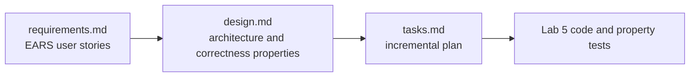

# Resources

| Resource | Use it for |
|---|---|
| [Planning Your First Chatbot](Planning_Your_First_Chatbot.md) | Business goals, scope, SMART goals, flow patterns (12 diagrams). Lecture 1 §7 |
| [LLM Model Parameters Handout](watsonx/LLM-Model-Parameters-Handout.md) | One-page reference for temperature, top-p, max tokens and penalties. Lecture 1 §5 |
| [watsonx slides (v1)](watsonx/5350-watonsx.pdf) · [v2](watsonx/5350-watonsx-v2.pdf) | IBM watsonx.ai Prompt Lab tour: system prompts, zero/one/few-shot, saving as a notebook |
| [watsonx capital demo notebook](watsonx/capital-demo.ipynb) | The same chat pattern on IBM Granite via the `ibm-watsonx-ai` SDK (needs an IBM Cloud API key and a project ID) |
| [Spec-driven development case study](spec-driven-dev/how-kiro-built-lab-5.md) | How an AI IDE (Kiro) produced Lab 5 from requirements → design → tasks |
| [Lab 5 specs](spec-driven-dev/specs/) | The actual `requirements.md` (EARS), `design.md` (correctness properties) and `tasks.md` |

